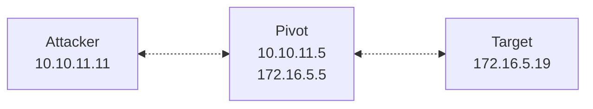

>[!abstract]+ **Scope**: Plink; outbound SSH connections and SSH port forwarding from a Windows host.

## Plink

 >**Plink** (PuTTY Link) is the command-line SSH client that ships as part of the [PuTTY](https://www.chiark.greenend.org.uk/~sgtatham/putty/latest.html) suite for Windows.

- You  can use Plink to originate outbound SSH sessions from a Windows host, or set up SSH port forwards.

>[!note] Windows 10 (version 1803 and later) and Windows 11 include a native OpenSSH client (`ssh.exe`).

- Plink works as an SSH client: it initiates outbound TCP conncetions to an SSH server and establishes an SSH tunnel (regardless of whether you're setting up local (`-L`), remote (`-R`), or dynamic (`-D`) forwarding).

>[!important] Plink is only useful when the Windows host can initiate outbound connections to an SSH server. It can't accept inbound SSH connections.

>[!note]+ If Plink is not present, you can download the `plink.exe` binary from the [official PuTTY download page](https://www.putty.org/). 

- If your private key is in standard OpenSSH format, you need to convert it to PuTTY's `.ppk` format first using `puttygen` (also ships with PuTTY):

```powershell
puttygen id_rsa -o id_rsa.ppk
```

## Connecting to an SSH server

- Connect to an SSH server:

```powershell
plink.exe -ssh jdoe@10.10.11.5
```

- Specify the username separately with `-l`:

```powershell
plink.exe -ssh -l jdoe 10.10.11.5
```

- Connect to a non-default port:

```powershell
plink.exe -ssh -P 2222 jdoe@10.10.11.5
```

- Enabling verbose output (useful for troubleshooting):

```powershell
plink.exe -v -ssh jdoe@10.10.11.5
```

- Supplying a password non-interactively:

```powershell
plink.exe -ssh jdoe@10.10.11.5 -pw "passwd123"
```

- Authenticate with a private key (the key must be in `.ppk` format):

```powershell
plink.exe -ssh -i C:\Users\jdoe\.ssh\jdoe.ppk jdoe@10.10.11.5
```

- Use `-batch` to disable all interactive prompts (including host key confirmation) — useful for scripting:

```powershell
plink.exe -batch -ssh jdoe@10.10.11.5 -i C:\Users\jdoe\.ssh\jdoe.ppk
```

## Running commands remotely

- Run a single command on the remote host, without opening an interactive shell:

```powershell
plink.exe -ssh jdoe@10.10.11.5 "id"
```

- Chain multiple remote commands using `&&`:

```powershell
plink.exe -ssh jdoe@10.10.11.5 "id && hostname && ip addr"
```

## Forwarding ports through Plink




### Local port forwarding

- Forward a local port on the Windows host to the internal service, through the SSH server:

```powershell
plink.exe -ssh jdoe@10.10.11.5 -L 8080:172.16.5.19:80
```

>[!note] See [[🛠️ SSH port forwarding#Local SSH port forwarding]].

### Remote port forwarding

- Forward a port from your machine back through the SSH server, to the internal service:

```powershell
plink.exe -ssh jdoe@10.10.11.11 -R 8080:172.16.5.19:80
```

>[!note] See [[🛠️ SSH port forwarding#Remote SSH port forwarding]].

### Dynamic port forwarding

- Open a local SOCKS listener on the Windows host, tunneled through the SSH server:

```powershell
plink.exe -ssh jdoe@10.10.11.5 -D 9050
```

- This opens a local SOCKS listener on the Windows host running Plink, on port `9050`.

>[!note] See [[🛠️ SSH port forwarding#Dynamic SSH port forwarding]].

>[!note] See [[🛠️ SOCKS]] to learn more about SOCKS proxies.

>[!tip]+
> - Confirm that `plink.exe` is running:
>
> ```powershell
> tasklist | findstr /I "plink"
> ```
>
> - Check the local listener (for `-L` or `-D`):
>
> ```powershell
> netstat -ano | findstr 9050
> ```
>
> - Check a remotely forwarded port from the other side (for `-R`), on the SSH server:
>
> ```bash
> ss -tlpn | grep 8080
> ```
>
> - Stop the Plink process:
>
> ```powershell
> taskkill /F /IM plink.exe
> ```

## Option reference

| Option   | Description                                                                                           |
| :------- | :---------------------------------------------------------------------------------------------------- |
| `-ssh`   | Force the SSH protocol (PuTTY also supports Telnet, Rlogin, Raw, and Serial).                         |
| `-l`     | Specify SSH username.                                                                                 |
| `-P`     | Connect to a non-default remote SSH port (default: `22`).                                             |
| `-pw`    | Supply SSH password non-interactively.                                                                |
| `-i`     | Specify SSH private key file, in PuTTY (`.ppk`) format.                                               |
| `-batch` | Disable all interactive prompts, including host key confirmation; aborts instead of waiting on input. |
| `-v`     | Enable verbose output (useful for troubleshooting).                                                   |
| `-N`     | Don't start a remote shell or command; only sets up the requested port forwards.                      |
| `-L`     | Set up local port forwarding.                                                                         |
| `-R`     | Set up remote port forwarding.                                                                        |
| `-D`     | Open a local dynamic SOCKS listener.                                                                  |
| `-load`  | Load a saved PuTTY session profile (created in the PuTTY GUI or `putty.exe -save`).                   |

## References and further reading

- [`Using Plink — PuTTY documentation, Chapter 7`](https://the.earth.li/~sgtatham/putty/latest/htmldoc/Chapter7.html)
