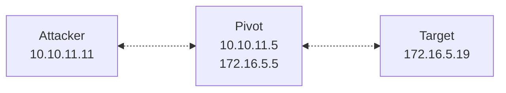

>[!abstract]+ **Scope**: Using `netsh interface portproxy` to install static, kernel-level TCP port-forwarding rules on Windows.
## `netsh`

 >[`netsh`](https://learn.microsoft.com/en-us/windows-server/administration/windows-commands/netsh) (Network Shell) is a built-in Windows command-line utility for configuring and managing network components.
 
 >[!note] `netsh` ships on every Windows install by default; you don't need to install anything.

- The `netsh` [`interface portproxy`](https://learn.microsoft.com/en-us/windows-server/administration/windows-commands/netsh-interface) context manages static TCP port-forwarding rules — useful for pivoting.
- Forwarding rules come in four address-family combinations:
	- `v4tov4` — IPv4 listener to an IPv4 destination.
	- `v4tov6` — IPv4 listener to an IPv6 destination.
	- `v6tov4` — IPv6 listener to an IPv4 destination.
	- `v6tov6` — IPv6 listener to an IPv6 destination.

>[!important] `netsh interface portproxy` forwards TCP traffic only. It has no support for UDP, SOCKS, or encryption.

- Each rule maps one fixed listen address/port to one fixed destination address/port. Reaching several destinations means adding several rules.

- A `portproxy` rule is fundamentally different from a userland relay process such as [[socat]]. Instead of a program that reads from one socket and writes to another, the rule is a static mapping the operating system's network stack enforces on your behalf.

---

- `portproxy` rules are installed and enforced by the `IP Helper` service (`iphlpsvc`). The service then intercepts and redirects matching connections at the OS/network-stack level.
- **Adding or removing rules requires local `Administrator` rights**, because the process changes the service's configuration.
- Because forwarding happens inside the service rather than in a foreground process you launch, **`portproxy` rules survive across logon sessions**.

>[!important] **Requirements**: Local `Administrator` privileges on the pivot; the `IP Helper` service (`iphlpsvc`) running on the host; ability to accept inbound connections on the pivot.

## Using `netsh interface portproxy`

### Forwarding inbound connections to the pivot

- List existing `portproxy` rules:

```powershell
netsh interface portproxy show all
```




- Add a `v4tov4` rule to forward connections:

```powershell
netsh interface portproxy add v4tov4 listenaddress=0.0.0.0 listenport=8080 connectaddress=172.16.5.19 connectport=80
```

- The command above starts a listener on `0.0.0.0:8080`. Any connection arriving at that listener is forwarded to `172.16.5.19:80`.

>[!tip]+
> - Add the matching firewall allow rule so external hosts can reach the listen port:
> 
> ```powershell
> netsh advfirewall firewall add rule name="portproxy-8080" protocol=TCP dir=in localport=8080 action=allow
> ```

- From your attacking machine, connect to `10.10.11.5:8080`. The pivot redirects that connection to `172.16.5.19:80`, and the response is relayed back the same way.

>[!tip]+
> - Show the specific rule that was just added:
> ```powershell
> netsh interface portproxy show v4tov4
> ```
> - Confirm the listening socket is bound and active:
> ```powershell
> netstat -ano | findstr <port>
> ```
>
>
>>[!note] `netstat` shows the listening socket that `IP Helper` opened on behalf of the rule; it won't show a separate user process, since none exists.

- Remove a rule:

```powershell
netsh interface portproxy delete v4tov4 listenaddress=0.0.0.0 listenport=8080
```

>[!tip]+
> - Remove the matching firewall rule:
> 
> ```powershell
> netsh advfirewall firewall delete rule name="portproxy-8080"
> ```

- Remove all `portproxy` rules on the host:

```powershell
netsh interface portproxy reset
```

>[!warning] `netsh interface portproxy reset` removes all portproxy rules configured on the host, not just the one you added. Restoring the rules means adding them again manually.

### Forwarding connections through the pivot to your listener

- The pattern above forwards inbound connections to another internal host. You can also forward a listen port on the pivot outward to a listener you control, which relays an inbound connection out to your own infrastructure:

```powershell
netsh interface portproxy add v4tov4 listenport=8080 listenaddress=172.16.5.5 connectaddress=10.10.11.11 connectport=4444
```

- Here the pivot listens on `172.16.5.5:8080` and forwards anything it receives to `10.10.11.11:4444` on your machine.

## Command reference

| Verb         | Description                                                                     |
| :----------- | :------------------------------------------------------------------------------ |
| `add v4tov4` | Forward an IPv4 listener to an IPv4 destination.                                |
| `add v4tov6` | Forward an IPv4 listener to an IPv6 destination.                                |
| `add v6tov4` | Forward an IPv6 listener to an IPv4 destination.                                |
| `add v6tov6` | Forward an IPv6 listener to an IPv6 destination.                                |
| `show`       | List configured rules (`show all`, `show v4tov4`, `show v6tov4`, and so on).    |
| `delete`     | Remove a single rule matching the given address family and listen address/port. |
| `reset`      | Remove all configured portproxy rules.                                          |

| Parameter        | Description                                                                                                                                         |
| :--------------- | :-------------------------------------------------------------------------------------------------------------------------------------------------- |
| `listenaddress`  | Local address the rule listens on.                                                                                                                  |
| `listenport`     | Local port the rule listens on.                                                                                                                     |
| `connectaddress` | Destination address the connection gets forwarded to.                                                                                               |
| `connectport`    | Destination port the connection gets forwarded to.                                                                                                  |
| `protocol`       | Protocol for the rule (portproxy handles TCP; this parameter appears on related `netsh` firewall commands such as `advfirewall firewall add rule`). |
| `name`           | Identifies the firewall rule (`advfirewall firewall` commands only), used to reference it later, e.g. on `delete`.                                  |
| `dir`            | Traffic direction the firewall rule applies to (`in` or `out`).                                                                                     |
| `localport`      | Local port the firewall rule matches (`advfirewall firewall` context; distinct from portproxy's `listenport`).                                      |
| `action`         | Action the firewall rule takes on a match (`allow` or `block`).                                                                                     |


## References and further reading

- [`netsh interface — Microsoft Learn`](https://learn.microsoft.com/en-us/windows-server/administration/windows-commands/netsh-interface)
- [`Netsh commands for Interface Portproxy — Microsoft Learn`](https://learn.microsoft.com/en-us/previous-versions/windows/it-pro/windows-server-2008-r2-and-2008/cc731068%28v=ws.10%29)
