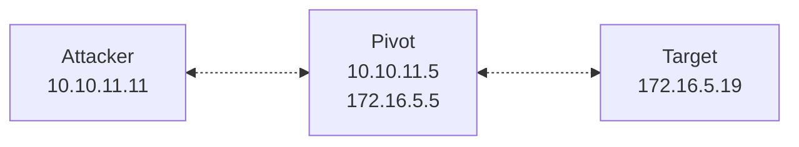

>[!abstract]+ **Scope**: `sshuttle`.
## `sshuttle`

>[`sshuttle`](https://github.com/sshuttle/sshuttle) is a transparent proxy that provides VPN-like access to remote networks over SSH (it's often called a "poor man's VPN"). It establishes an SSH connection to a remote host and transparently relays traffic through it.

- `sshuttle` forwards traffic over an SSH connecion. Specify one or more target network ranges, and packets destined for any of those addresses get transparently redirected through the pivot.

- `sshuttle` can route traffic to an entire subnet, so you don't need to create a separate port forward for each service you intend to access.

>[!note] No SOCKS proxy is involved: local firewall rules (uch as `iptables` on Linux) transparently intercept traffic destined for the selected networks and redirect it to `sshuttle`. This means, you can use `nmap` or `curl` directly, without `proxychains`.

## How `sshuttle` works

- `sshuttle` runs locally on your machine; on the pivot, you only need SSH access (and a compatible Python interpreter).
- When a connection is established, `sshuttle` transfers a smal Python server component and starts it on the remote host through the SSH session (you don't need to install it manually; `sshuttle` handles the process automatically).
- Locally, `sshuttle` installs firewall rules (e.g., `iptables` on Linux) that intercept supported traffic destined for the specified subnet(s) and redirect it to its local proxy process. 
- The local proxy carries the intercepted connection through the SSH transport to the remote `sshuttle` server, which establishes a corresponding connection to the destination and relays data between the two sides.

>[!note] For TCP traffic, `sshuttle` operates transparently at the connection level: it intercepts the local connection and establishes a corresponding connection from the remote side.

>[!note] `sshuttle` doesn't encapsulate arbitrary IP packets or create `TUN`/`TAP` virtual interfaces.

- With `--dns`, `sshuttle` can intercept local DNS queries and forward them through the remote side, so internal hostnames that only resolve on the target network can also resolve locally.

>[!warning] `sshuttle` needs local `root` privileges on your attacking machine (because the tool must install firewall rules to intercept traffic).

>[!important] **Requirements**: SSH access to a pivot host; a compatible Python interpreter installed on the pivot; `root` privileges on your attacking machine.

>[!note]+ Installation
> ```bash
> pip install sshuttle
> ```
## Running `sshuttle`



- Start a subnet tunnel:

```bash
sshuttle -r jdoe@10.10.11.5 172.16.5.0/24
```

>[!note] Unless key-based authentication is configured, the SSH client prompts for credentials interactively.

>[!note] By default, `sshuttle` runs in the foreground; the tunnel works only as long as the `sshuttle` session is active.

- Run `sshuttle` in the background:

```bash
sshuttle -r jdoe@10.10.11.5 172.16.5.0/24 -D --pidfile=/tmp/sshuttle.pid
```

>[!tip]+
> - To terminate the `sshuttle` process later, `kill` it using the `pidfile`:
>```bash
>kill $(cat /tmp/sshuttle.pid)
>```

- Enable DNS proxying:

```bash
sshuttle -r jdoe@10.10.11.5 172.16.5.0/24 --dns
```

- Specify an SSH key for authentication:

```bash
sshuttle -r jdoe@10.10.11.5 172.16.5.0/24 -e "ssh -i ~/.ssh/id_pivot"
```

- Connect to a nonstandard port:

```bash
sshuttle -r jdoe@10.10.11.5 172.16.5.0/24 -e "ssh -i ~/.ssh/id_pivot -p 2222"
```

>[!warning] `sshuttle` removes its own firewall rules on a clean exit. If the process is terminated abruptly, such as using `SIGKILL` (`kill -9`), you may need to remove the rules manualy.

## Option reference

| Flag                 | Description                                                                                                                                         |
| -------------------- | --------------------------------------------------------------------------------------------------------------------------------------------------- |
| `-r`, `--remote`     | SSH target to connect through, as `[username@]host[:port]`.                                                                                         |
| `-N`, `--auto-nets`  | Read a routing table on the remote host and forwards the discovered subnets automatically, instead of (or in addition to) the ones listed manually. |
| `-H`, `--auto-hosts` | Discover hostnames from the remote side and temporarily add corresponding entries to the local `/etc/hosts` file (while `sshuttle` is running).     |
| `-x`, `--exclude`    | Exclude a subnet or host from forwarding, even if it falls inside a routed range.                                                                   |
| `-D`, `--daemon`     | Run `sshuttle` in the background as a daemon.                                                                                                       |
| `--dns`              | Capture local DNS queries and resolve them through the remote side.                                                                                 |
| `--to-ns`            | Forward captured DNS queries to a specific DNS server, instead of the remote host's own resolver.                                                   |
| `-v`, `--verbose`    | Increase output verbosity; repeat for more detail.                                                                                                  |
| `-l`, `--listen`     | Specify the local address/port to use for the `sshuttle`'s transparent proxy listener (by default, the local port is selected automatically).       |
| `--pidfile`          | Path to write the daemon's PID to, for use with `-D`.                                                                                               |
| `-e`, `--ssh-cmd`    | Override the SSH command line `sshuttle` uses (for SSH options).                                                                                    |
## References and further reading

- [`sshuttle — GitHub`](https://github.com/sshuttle/sshuttle)
- [`sshuttle documentation — Read the Docs`](https://sshuttle.readthedocs.io/)
